# Homelab Architecture — Proxmox / Debian Docker Host

> **Generated:** 2026-09-16 from a live inspection of VM 100 (`debian-docker`).
> **Scope:** Proxmox hypervisor + ZFS storage, the Debian 12 guest, its native services, and 34 Docker containers across 6 Compose projects.
> **Sanitization:** all secrets, public IPs, tailnet names and real domains are replaced with placeholders (`<YOUR_SECRET>`, `192.168.x.x`, `*.example.com`, `<tailnet>.ts.net`).

| Document | Purpose |
|---|---|
| [README.md](README.md) | Executive summary, topology, phase blueprint, stability highlights |
| [architecture/networking-and-security.md](architecture/networking-and-security.md) | Ingress paths, Tailscale, Gluetun, port matrix, security posture |
| [services/container-workloads.md](services/container-workloads.md) | Every stack and container, memory rationale, storage/bind-mount map |
| [runbooks/disaster-recovery.md](runbooks/disaster-recovery.md) | Hypervisor rebuild, ZFS re-import, VM 100 restore, backup validation |

---

## 1. Executive summary

A single Proxmox VE 9.2 node hosts one primary guest, **VM 100 `debian-docker`** (Debian 12 bookworm, 4 vCPU, 12 GB RAM, 102 GB virtio boot disk, NVIDIA RTX 2060 SUPER passed through via PCIe). The guest runs Docker Engine 29.6 with Compose 5.3 and is the platform for every workload in the lab:

- **Gaming:** Paper Minecraft (tuned JVM, 5 GB cgroup cap, daily RCON-driven backups), Terraria, and Playit.gg tunnels for public reachability without port-forwarding.
- **Media & books:** Jellyfin, Sonarr/Radarr/Prowlarr, qBittorrent behind a Mullvad WireGuard tunnel (Gluetun), Kavita and LazyLibrarian.
- **AI / automation:** Ollama (qwen3:8b), n8n, Stirling-PDF.
- **Application platform:** a full self-hosted Supabase stack (Postgres 17, Kong, GoTrue, PostgREST, Realtime, Storage, Studio, Supavisor) plus the "Mush" React front-end served by nginx.
- **Management & observability:** Vaultwarden, Homepage, Uptime-Kuma, Dozzle, Prometheus + node-exporter + Grafana.
- **Access:** Tailscale mesh (MagicDNS enabled, watchdog cron) for private access; host-native nginx 1.22 with Let's Encrypt (certbot + Cloudflare DNS-01) for four public HTTPS vhosts; a headless Chrome/Xvfb/noVNC stack driven by Playwright MCP.

### Health snapshot (2026-09-16)

| Signal | Observed | Assessment |
|---|---|---|
| VM uptime | 4 d 2 h | Stable |
| RAM | 5.1 GiB used / 11.7 GiB, 6.6 GiB available | OK |
| Swap | **5.7 GiB used / 8 GiB** (swappiness 60) | High — cold pages from idle containers; watch for thrash |
| Root disk `/` | **84 GB / 101 GB (88 %)** | Action needed — Docker images alone are 43 GB (9.5 GB reclaimable) |
| Containers | 33 running, 1 exited (`stirling-pdf`, exit 137) | Investigate |
| GPU | RTX 2060 SUPER, 1 MiB VRAM used | **Idle** — Ollama fell back to CPU (driver 535 < required 550) |
| TLS certs | 3 Let's Encrypt certs, ~70 days to expiry, `certbot.timer` active | OK |
| Tailscale | Online, 3 peers, MagicDNS on | OK (watchdog fired twice on 2026-09-11) |
| QEMU guest agent | Installed but **inactive** | Enable for consistent PBS snapshots |

---

## 2. Topology diagram

```mermaid
flowchart TB
    subgraph INTERNET["Internet"]
        USER["Public clients"]
        TSNET["Tailscale DERP / peers<br/>(3 peers, MagicDNS)"]
        PLAYIT["Playit.gg relay"]
        MULLVAD["Mullvad WireGuard exit (USA)"]
        LE["Let's Encrypt<br/>(DNS-01 via Cloudflare API)"]
    end

    subgraph PVE["Proxmox VE 9.2.4 — kernel 7.0.14-5-pve"]
        direction TB
        subgraph FAST["ZFS fastpool — 8.72 TB NVMe/SSD"]
            FP_VM["fastpool/vm-100-disk-0<br/>(102 GB zvol → VM /dev/sda)"]
            FP_APP["fastpool/appdata"]
            FP_PHOTOS["fastpool/photos"]
            FP_VMS["fastpool/vms"]
        end
        subgraph HDD["ZFS hddpool — 2.72 TB HDD"]
            HP_BAK["hddpool/backups"]
            HP_MEDIA["hddpool/media"]
        end
        GPU["PCIe passthrough<br/>NVIDIA RTX 2060 SUPER 8 GB"]

        subgraph VM100["VM 100 · debian-docker · Debian 12 · 4 vCPU · 12 GB RAM"]
            direction TB
            ROOTFS["/dev/sda1 ext4 (101 GB, 88 % used)<br/>/mnt/tank · /docker · /var/lib/docker · 8 GB swapfile"]
            subgraph NATIVE["Host-native services"]
                NGINX["nginx 1.22<br/>:80 :443 → 127.0.0.1 upstreams"]
                TSD["tailscaled 1.102<br/>tailscale0 100.x.x.x"]
                PLAYITD["playitd (systemd, UDP)"]
                VNC["Xvfb :99 → x11vnc :5900 → websockify/noVNC :3010<br/>Google Chrome (Playwright MCP)"]
                SSHD["sshd :22"]
            end
            subgraph SERVERNET["Docker bridge: server-net (172.22.x.x/16) — 19 containers"]
                direction LR
                subgraph GAMING["gaming"]
                    MC["minecraft (Paper)<br/>-Xms1G -Xmx4G · cap 5 GB"]
                    MCB["mc-backup · cap 512 MB"]
                    TERR["terraria · cap 2 GB"]
                end
                subgraph MEDIA["media"]
                    GLUE["gluetun (NET_ADMIN, /dev/net/tun)"]
                    QBT["qbittorrent<br/>network_mode: service:gluetun"]
                    JF["jellyfin (nvidia runtime)"]
                    ARR["sonarr · radarr · prowlarr<br/>kavita · lazylibrarian"]
                end
                subgraph AI["ai-tools"]
                    OLL["ollama (qwen3:8b)<br/>CPU fallback · no cap"]
                    N8N["n8n · cap 1 GB<br/>127.0.0.1:5678"]
                    SPDF["stirling-pdf · cap 1 GB<br/>(exited 137)"]
                end
                subgraph MGMT["management"]
                    VW["vaultwarden :8222"]
                    HP["homepage :3000"]
                    UK["uptime-kuma :3001"]
                    DZ["dozzle :8888"]
                    PROM["prometheus :9090"]
                    NE["node_exporter (pid: host)"]
                    GRAF["grafana :3005"]
                end
            end
            subgraph SUPANET["Docker bridge: supabase_default (172.18.x.x/16) — 11 containers"]
                KONG["kong :8000/:8443"]
                STUDIO["studio 127.0.0.1:3002"]
                PG["postgres 17 + supavisor :5432/:6543"]
                SB["auth · rest · realtime · storage<br/>imgproxy · meta · edge-functions"]
            end
            subgraph MUSHNET["Docker bridge: mush_default (172.19.x.x/16)"]
                MUSH["mush-frontend nginx:alpine :8085"]
            end
            PLAYITC["playit container<br/>network_mode: host"]
        end
    end

    FP_VM --> ROOTFS
    GPU --> VM100
    GPU -. "driver 535 too old for Ollama,<br/>Jellyfin NVENC available" .-> OLL
    GPU --> JF

    USER -- "443/80 *.example.com" --> NGINX
    LE -. "certbot.timer renew" .-> NGINX
    NGINX --> N8N
    NGINX --> SPDF
    NGINX --> MUSH
    NGINX --> STUDIO
    NGINX -- "/rest|/auth|/storage|/realtime/v1" --> KONG

    TSNET <--> TSD
    TSD -- "LAN-bound ports reachable<br/>over tailnet" --> SERVERNET

    USER -- "25565 / 7777 via relay" --> PLAYIT
    PLAYIT <--> PLAYITD
    PLAYIT <--> PLAYITC
    PLAYITD --> MC
    PLAYITD --> TERR

    GLUE <--> MULLVAD
    QBT --> GLUE
    MCB -- "RCON save-off / save-all" --> MC

    HP_BAK -. "target for VM backups (PBS / vzdump) — not yet wired" .-> VM100
    HP_MEDIA -. "intended NFS export for /mnt/media — not mounted" .-> VM100
    FP_PHOTOS -. "intended export for /mnt/photos — not mounted" .-> VM100

    classDef warn fill:#fff3cd,stroke:#b8860b,color:#333;
    classDef bad fill:#f8d7da,stroke:#a33,color:#333;
    class SPDF,OLL,ROOTFS warn;
```

**Reading the diagram**

- The only storage the guest actually sees is the **102 GB zvol** (`fastpool/vm-100-disk-0`). The paths `/mnt/tank`, `/docker`, `/mnt/media` and `/mnt/photos` are plain directories on that ext4 root, not ZFS datasets or NFS mounts. `hddpool/media`, `hddpool/backups` and `fastpool/photos` are currently **not attached to the VM** (dotted edges). See the storage section in [services/container-workloads.md](services/container-workloads.md#5-storage-model).
- Three isolated Docker bridges exist: `server-net` (shared by the four home-grown stacks), `supabase_default` and `mush_default`. Cross-network traffic goes through host-published ports.
- nginx is the only TLS terminator and proxies exclusively to `127.0.0.1` upstreams.

---

## 3. Phase blueprint checklist

Status in the first column is the plan of record; the **Observed** column is what the live inspection found on 2026-09-16.

| Phase | Item | Plan | Observed |
|---|---|---|---|
| 1.1 | Stirling-PDF (Docker on :8081) | [x] | Deployed (`ai-tools`), proxied at `pdf.example.com` (HTTP only). Container currently **exited (137)**; limit is 1 GB, no custom JVM flags. |
| 1.2 | Remote Development ("Zero-Sync" VS Code SSH) | [x] | sshd on :22, reachable over LAN + tailnet. Root + password login are enabled (see security posture). |
| 2.1 | Security & Torrents (gluetun) | [x] | Gluetun (Mullvad WireGuard, USA) with qBittorrent in `network_mode: service:gluetun`, healthcheck-gated. |
| 2.2 | Media & Backup (Jellyfin / Immich) | [ ] | Jellyfin **is deployed** and healthy, but `/mnt/tank/media` is empty (16 KB) and no ZFS media export is mounted. Immich absent. |
| 2.3 | Terraria Server | [x] | Running, 2 GB cap, nightly tar backup via root cron (7-day retention). |
| 2.4 | Minecraft Server (Paper, -Xms1G -Xmx4G) | [x] | Confirmed from live JVM cmdline: Aikar flags + `-Xms1G -Xmx4G`, 5 GB cgroup cap, mc-backup every 24 h keeping 7. |
| 2.5 | External Gaming Connectivity & Admin Permissions | [x] | Playit agent running both as host systemd service **and** as a `network_mode: host` container (duplicate). RCON enabled on :25575. |
| 2.6 | System Monitoring (Prometheus/Grafana) | [ ] | Prometheus, node-exporter and Grafana **are running**; only one scrape job (`node-exporter`). No cAdvisor, no alerting. Consider marking partially done. |
| 3.1 | Containerized Headless Game Host (Steam/Wolf) | [ ] | Not present. |
| 3.2 | VRAM Balancing (Ollama) | [x] | **Not effective.** Ollama logs `NVIDIA driver too old (535, requires 550+)` and runs on CPU. GPU VRAM usage is 1 MiB. |
| 3.3 | Retroid Pocket Flip 2 Streaming (Moonlight) | [ ] | Not present. |
| 3.4 | Interactive Web Terminals (ttyd sidecars) | [ ] | Not present. |
| 3.5 | RAM Resource Caps & Ollama Memory Isolation | [x] | Caps exist for minecraft/terraria/n8n/stirling/mc-backup. **Ollama has no memory limit** at runtime; Supabase, media and management containers are uncapped. |
| 4.1 | Heavy Local AI Workstation (RX 9070 XT) | [ ] | Not present; current GPU is RTX 2060 SUPER. |
| 4.2 | Remote Desktop Power Management (Wake-on-LAN) | [ ] | Not present. |
| 5.1 | Custom React Dashboard UI | [ ] | `mush-frontend` (React build served by nginx:alpine) exists and is proxied at `mush.example.com`; Homepage dashboard also running. |
| 5.2 | Live Service Integration | [ ] | Supabase stack deployed as backend; nginx routes `/rest|/auth|/storage|/realtime` to Kong. |
| 5.3 | Embedded Game Terminals | [ ] | Not present. |

---

## 4. Resource safety & stability highlights

### 4.1 Memory envelope (12 GB guest)

| Consumer | Hard cap | Typical RSS | Notes |
|---|---|---|---|
| minecraft (Paper) | 5 GiB (swap ceiling 10 GiB) | ~870 MiB idle, up to 4 GiB heap + ~0.5 GiB off-heap | `-Xms1G -Xmx4G` leaves ~1 GiB headroom under the cgroup for JVM metaspace, GC threads, and native buffers. |
| terraria | 2 GiB | ~32 MiB | Generous; world gen spikes are short. |
| n8n | 1 GiB | ~300 MiB | Node heap; workflows with large payloads can approach the cap. |
| stirling-pdf | 1 GiB | n/a (stopped) | Java 25 with image defaults (`-XX:+ExitOnOutOfMemoryError`, G1). Target of `-Xms64m -Xmx256m` / 512 MB is **not applied**. |
| mc-backup | 512 MiB | ~3 MiB | tar + RCON client only. |
| ollama | **none** | ~900 MiB idle | With CPU inference a 5.2 GB model is paged into RAM; `OLLAMA_KEEP_ALIVE=0` unloads immediately after each request. |
| supabase (11) | none | ~1.0 GiB aggregate | Kong ~270 MiB, Studio ~210 MiB. |
| all other containers | none | ~1.1 GiB aggregate | |
| host-native (Chrome/Xvfb, claude-mem worker, nginx, tailscaled) | none | ~1.5 GiB | Playwright Chrome renderers are the largest native consumers. |

Sum of hard caps is 9.5 GiB, which alone is ~81 % of guest RAM; uncapped workloads share whatever is left. The 8 GB swapfile absorbs the overflow (5.7 GiB in use), which explains the stability but also the latency risk if Ollama and Minecraft peak together.

### 4.2 Stability controls in place

- **Restart policy** `unless-stopped` on every container; Compose `depends_on: condition: service_healthy` gates qBittorrent on Gluetun.
- **Healthchecks** present on minecraft, gluetun, kavita, jellyfin, vaultwarden, uptime-kuma, homepage and all Supabase services.
- **Backups:** mc-backup (24 h, retain 7, RCON-consistent) and a root cron for Terraria (04:00 daily, 7-day prune). Both land in `/mnt/tank/backups` — on the same disk as the data.
- **Tailscale watchdog:** `*/5 * * * * /usr/local/bin/tailscale-watchdog.sh` pings `100.100.100.100` and restarts `tailscaled` on failure.
- **TLS renewal:** `certbot.timer` (snap) with Cloudflare DNS-01, so no inbound :80 challenge is required.
- **Kernel memory pressure:** PSI shows 0 % stall at inspection time; no kernel OOM-kill events in the journal.

### 4.3 Open risks (ordered by impact)

1. **Root disk at 88 %.** Docker image layers (43 GB, 9.5 GB reclaimable), Stirling OCR training data (7.6 GB), Ollama models (4.9 GB) and the swapfile (8 GB) all live on the one zvol. Prune images or move `/docker/appdata/ollama` and `/mnt/tank` to a dedicated virtual disk on `fastpool/appdata`.
2. **Backups are not off-box.** Nothing in the guest ships to `hddpool/backups`, PBS, or offsite. A zvol failure loses data and backups together.
3. **GPU unused.** Driver 535 in the guest blocks Ollama CUDA (needs 550+). Upgrade to the bookworm-backports NVIDIA driver or pin an older Ollama image.
4. **Exposure:** every published port binds `0.0.0.0` on the LAN; there is no host firewall besides Tailscale's own chain; sshd permits root + password; x11vnc runs `-nopw` on :5900. Details and remediation in [architecture/networking-and-security.md](architecture/networking-and-security.md#6-security-posture).
5. **Duplicate Playit agents** (systemd + container) can race for the same tunnel secret.
6. **QEMU guest agent inactive**, so hypervisor snapshots/backups are crash-consistent rather than filesystem-quiesced.
