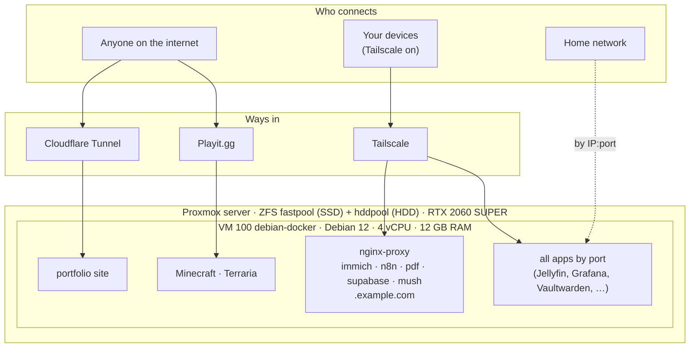

# Homelab

> One Proxmox server running one Debian VM (`debian-docker`) with **40 Docker containers**: photos, media, games, automation, a database platform, and a public portfolio site.
> Last verified 2026-09-25 with [`scripts/audit-homelab.sh`](scripts/audit-homelab.sh). All secrets, IPs, usernames and the real domain are replaced with placeholders (`<YOUR_SECRET>`, `192.168.x.x`, `example.com`, `<user>`).

## Where to find what

| Folder | What's in it | Start here |
|---|---|---|
| [`architecture/`](architecture/README.md) | Hardware, the VM, disks, network maps, reverse-proxy flow, who can reach what, security | [host-and-vm.md](architecture/host-and-vm.md), [networking-and-security.md](architecture/networking-and-security.md) |
| [`services/`](services/README.md) | One page per app stack: what it does, ports, where its data lives, backups | [services/README.md](services/README.md) (overview table) |
| [`runbooks/`](runbooks/README.md) | Step-by-step guides: routine maintenance and disaster recovery | [maintenance.md](runbooks/maintenance.md) |
| [`scripts/`](scripts/README.md) | `audit-homelab.sh` (snapshot for the docs), `add-site.sh` (add a website) | [scripts/README.md](scripts/README.md) |
| [`roadmap/`](roadmap/ROADMAP.md) | To-do list by urgency, wishlist, tech debt | [ROADMAP.md](roadmap/ROADMAP.md) |

## What's running

| Area | Apps | Details |
|---|---|---|
| Photos | Immich | [services/immich.md](services/immich.md) |
| Media & books | Jellyfin, Sonarr, Radarr, Prowlarr, qBittorrent (through a VPN), Kavita, LazyLibrarian | [services/media.md](services/media.md) |
| Games | Minecraft (Paper), Terraria, Playit tunnels | [services/gaming.md](services/gaming.md) |
| AI & automation | n8n, Ollama (LLM), Stirling-PDF | [services/ai-tools.md](services/ai-tools.md) |
| App backend | Supabase (Postgres, auth, API, storage) | [services/supabase.md](services/supabase.md) |
| Management | Vaultwarden, Homepage, Uptime-Kuma, Dozzle, Prometheus, Grafana | [services/management.md](services/management.md) |
| Websites | Portfolio (public), Mush front-end | [services/web-apps.md](services/web-apps.md) |

## How it fits together

- **Public (internet):** only the portfolio site and the two game servers.
- **Private (Tailscale):** every app. The `*.example.com` names resolve to the server's Tailscale IP, so they only work with Tailscale on.
- **Home network:** can reach apps by `IP:port` without Tailscale.

Details: [architecture/networking-and-security.md](architecture/networking-and-security.md).

## Health snapshot (2026-09-25)

| | Status | Notes |
|---|---|---|
| Containers | 🟢 40/40 running | 0 OOM kills |
| Disk | 🟢 boot 15 %, data 3 % | 502 GB boot + 1.5 TB data disk |
| Memory | 🔴 swap 7.9 / 8 GB | Immich + uncapped apps; the VM stalls under load |
| Backups | 🔴 partial | Only Minecraft works; Terraria broken; **Immich, Supabase, Vaultwarden, n8n have none**; no VM backup |
| Public exposure | 🟡 small | Portfolio + game servers (game servers have no whitelist/password) |
| GPU | 🟡 unused by Ollama | Driver 535 too old; Jellyfin uses it |
| Updates | 🟡 40 OS updates pending | No automatic updates |
| Guest agent | 🟡 off | Off in Proxmox and in the VM |

## 📌 Current Focus & Roadmap

- 🔴 **In Progress:** Optimizing Debian VM memory usage (more RAM for the VM, caps on Immich) and tuning Immich background jobs/uploads.
- 🟠 **Urgent:** Fix the broken Terraria backup (one-line cron fix) and lock the public game servers (whitelist / password).
- 🟡 **Next Up:** Setting up automated offsite backups for Supabase and Immich data (restic/Borg), plus a Proxmox backup job for the whole VM.
- 📋 **Full List:** See [roadmap/ROADMAP.md](roadmap/ROADMAP.md) for detailed task tracking and future architecture plans.

## Keeping these docs current

Run the audit script, save the report **outside** the repo, and update the docs from it. Reports are never committed. How-to: [scripts/README.md](scripts/README.md) and [runbooks/maintenance.md](runbooks/maintenance.md#refresh-these-docs).
