# Homelab Architecture — Proxmox / Debian Docker Host

> **Last verified:** 2026-09-25 with [`scripts/audit-homelab.sh`](scripts/audit-homelab.sh) on VM 100 (`debian-docker`), plus targeted checks. First inspection: 2026-09-16.
> **Scope:** Proxmox hypervisor + ZFS storage, the Debian 12 guest, its native services, and 40 Docker containers across 9 Compose projects.
> **Sanitization:** all secrets, public IPs, tailnet names, usernames and real domains are replaced with placeholders (`<YOUR_SECRET>`, `192.168.x.x`, `*.example.com`, `<tailnet>.ts.net`, `<user>`).

| Document | Purpose |
|---|---|
| [README.md](README.md) | Executive summary, topology, phase blueprint, stability highlights |
| [architecture/networking-and-security.md](architecture/networking-and-security.md) | Ingress paths (nginx, Cloudflare Tunnel, Playit, Tailscale), Gluetun, port matrix, security posture |
| [services/container-workloads.md](services/container-workloads.md) | Every stack and container, memory rationale, storage/bind-mount map, drift register |
| [runbooks/disaster-recovery.md](runbooks/disaster-recovery.md) | Hypervisor rebuild, ZFS re-import, VM 100 restore, backup validation |
| [scripts/audit-homelab.sh](scripts/audit-homelab.sh) | Read-only, redacted audit of the VM that feeds these docs (see §5) |

---

## 1. Executive summary

A single Proxmox VE 9.2 node hosts one primary guest, **VM 100 `debian-docker`** (Debian 12 bookworm, 4 vCPU, 12 GB RAM, NVIDIA RTX 2060 SUPER passed through via PCIe). Since the first inspection the VM has had its boot disk grown to **502 GB** and gained a second **1.5 TB data disk** mounted at `/mnt/tank`. It runs Docker Engine 29.6 with Compose 5.3 and is the platform for every workload in the lab:

- **Gaming:** Paper Minecraft (tuned JVM, 5 GB cgroup cap, RCON-driven backups), Terraria, and Playit.gg tunnels for public reachability without port-forwarding.
- **Media, photos & books:** Jellyfin, Sonarr/Radarr/Prowlarr, qBittorrent behind a Mullvad WireGuard tunnel (Gluetun), Kavita, LazyLibrarian, and **Immich** (new since 2026-09-16) for the photo library.
- **AI / automation:** Ollama (qwen3:8b, still CPU-only), n8n, Stirling-PDF.
- **Application platform:** a full self-hosted Supabase stack (Postgres 17, Kong, GoTrue, PostgREST, Realtime, Storage, Studio, Supavisor), the "Mush" React front-end, and a **portfolio** static site (new).
- **Management & observability:** Vaultwarden, Homepage, Uptime-Kuma, Dozzle, Prometheus + node-exporter + Grafana.
- **Access:**
  - **Containerized nginx** (`nginx-proxy`, the `reverse-proxy` stack) terminates TLS for five public vhosts. The host-native nginx from the first inspection is now disabled.
  - A **Cloudflare Tunnel** (`cloudflared`, remotely managed) provides a second public ingress path.
  - Tailscale for private access.
  - Let's Encrypt certificates come from certbot with Cloudflare DNS-01.
  - A headless Chrome/Xvfb/noVNC stack still runs natively for Playwright MCP.

### Health snapshot (2026-09-25)

| Signal | Observed | Assessment |
|---|---|---|
| VM uptime | 1 d 13 h (rebooted 2026-09-23 ~12:20) | Recent reboot; see stability signals |
| RAM | 7.3 GiB used / 11.7 GiB, 4.4 GiB available | Tight |
| Swap | **7.9 GiB used / 8 GiB** | **Critical.** Swap is exhausted; the next memory spike has nowhere to go |
| CPU / load | 15-min load average peaked at **~80 on 4 vCPU** during the audit window | **Critical.** Immich ML + a 160 % CPU Python process + swap I/O |
| Kernel stability | This boot: 8 RCU stall reports, 16 `virtio_net` TX timeouts, hung-task warnings | **Investigate.** The guest is being starved of CPU (host overcommit or swap storm) |
| Root disk `/` | 71 GB / 494 GB (15 %) | OK (was 88 % on a 102 GB disk) |
| Data disk `/mnt/tank` | 31 GB / 1.5 TB (3 %) | OK. Backing Proxmox storage not verifiable from the guest |
| Containers | 40 / 40 running, 0 restarts except `supabase-auth` (1), 0 OOM kills | OK |
| GPU | RTX 2060 SUPER, 1 MiB VRAM used | **Idle.** Ollama still logs "NVIDIA driver too old" (535 < 550) and runs on CPU |
| TLS certs | 4 Let's Encrypt certs (one wildcard), 61–89 days to expiry | OK. Two certbot installs both have renewal timers (apt + snap) |
| Cloudflare Tunnel | Active, 4/4 connections ready; ~20 QUIC timeout reconnects in 24 h; version 2026.9.1 flagged outdated | OK, noisy |
| Tailscale | Running, 5 peers (4 online), no serve/funnel | OK |
| QEMU guest agent | Service installed but **inactive**, and the guest has **no agent virtio channel** (the Proxmox VM option is off) | Fix both sides: `qm set 100 --agent 1` + VM stop/start, then enable the service |
| Core services | docker, containerd, cloudflared, cron, tailscaled, ssh active; `certbot.timer` + `snap.certbot.renew.timer` waiting | OK |
| Pending OS updates | 40 packages; `unattended-upgrades` not installed | Action needed |

---

## 2. Topology diagram

```mermaid
flowchart TB
    subgraph INTERNET["Internet"]
        USER["Public clients"]
        CF["Cloudflare edge<br/>(Tunnel, remotely managed)"]
        TSNET["Tailscale peers<br/>(5 peers, MagicDNS)"]
        PLAYIT["Playit.gg relay"]
        MULLVAD["Mullvad WireGuard exit"]
        LE["Let's Encrypt<br/>(DNS-01 via Cloudflare API)"]
    end

    subgraph PVE["Proxmox VE 9.2"]
        direction TB
        subgraph FAST["ZFS fastpool — SSD"]
            FP_VM["VM 100 boot disk<br/>(502 GB → /dev/sda)"]
            FP_OTHER["fastpool/appdata · photos · vms"]
        end
        subgraph HDD["ZFS hddpool — HDD"]
            HP_BAK["hddpool/backups"]
            HP_MEDIA["hddpool/media"]
        end
        DATA["1.5 TB virtual disk → /dev/sdb<br/>(backing storage: verify with qm config 100)"]
        GPU["PCIe passthrough<br/>NVIDIA RTX 2060 SUPER 8 GB"]

        subgraph VM100["VM 100 · debian-docker · Debian 12 · 4 vCPU · 12 GB RAM"]
            direction TB
            ROOTFS["/dev/sda1 ext4 494 GB (15 %)<br/>/var/lib/docker · /docker · /srv/games · supabase + immich DBs · 8 GB swapfile"]
            TANK["/dev/sdb ext4 1.5 TB (3 %) → /mnt/tank<br/>immich library · stirling data · media · backups"]
            subgraph NATIVE["Host-native services"]
                CFD["cloudflared (systemd)"]
                TSD["tailscaled 1.102"]
                PLAYITD["playit.service (host)"]
                VNC["Xvfb → x11vnc :5900 → noVNC :3010<br/>(tailnet-only) · Chrome (Playwright MCP)"]
                SSHD["sshd :22"]
                CERTBOT["certbot (apt + snap)<br/>/etc/letsencrypt"]
            end
            subgraph RPNET["reverse-proxy_default"]
                NGINX["nginx-proxy (nginx:alpine)<br/>:80 :443 · 5 vhosts"]
            end
            subgraph SERVERNET["server-net (172.22.x.x/16) — 20 containers"]
                direction LR
                GAMING["gaming: minecraft · mc-backup · terraria"]
                MEDIA["media: gluetun + qbittorrent (shared netns)<br/>jellyfin (GPU) · sonarr · radarr · prowlarr<br/>kavita · lazylibrarian"]
                AI["ai-tools: ollama (CPU fallback) · n8n · stirling-pdf"]
                MGMT["management: vaultwarden · homepage · uptime-kuma<br/>dozzle · prometheus · node_exporter · grafana"]
            end
            subgraph IMMNET["immich_default"]
                IMM["immich_server :2283 · machine-learning<br/>postgres (vectorchord) · valkey"]
            end
            subgraph SUPANET["supabase_default — 11 containers"]
                KONG["kong :8000/:8443"]
                SB["db · pooler :5432/:6543 · auth · rest · realtime<br/>storage · imgproxy · meta · functions · studio (127.0.0.1:3002)"]
            end
            MUSH["mush-frontend :8085<br/>(mush_default)"]
            PORT["portfolio-web :8090<br/>(portfolio_default)"]
            PLAYITC["playit container<br/>network_mode: host"]
        end
    end

    FP_VM --> ROOTFS
    DATA --> TANK
    GPU --> VM100
    GPU -. "driver 535 too old for Ollama" .-> AI

    USER -- "443/80 *.example.com" --> NGINX
    USER --> CF
    CF <--> CFD
    CFD -. "ingress rules live in the<br/>Cloudflare dashboard" .-> NGINX
    LE -. "renew" .-> CERTBOT
    CERTBOT -. "/etc/letsencrypt (ro)" .-> NGINX
    NGINX -- "host.docker.internal:&lt;port&gt;" --> IMM
    NGINX --> MUSH
    NGINX --> KONG
    NGINX --> AI

    TSNET <--> TSD
    TSD -- "every 0.0.0.0-published port" --> SERVERNET

    USER -- "25565 / 7777 via relay" --> PLAYIT
    PLAYIT <--> PLAYITD
    PLAYIT <--> PLAYITC
    MEDIA <--> MULLVAD

    HP_BAK -. "not attached to the VM" .-> VM100
    HP_MEDIA -. "not attached to the VM" .-> VM100

    classDef warn fill:#fff3cd,stroke:#b8860b,color:#333;
    classDef bad fill:#f8d7da,stroke:#a33,color:#333;
    class AI,PLAYITD,PLAYITC warn;
```



**Reading the diagram**

- The guest now has **two virtual disks**:
  - `/dev/sda` (502 GB) holds the OS, Docker images, `/docker` app configs, the game servers in `/srv/games`, and the Supabase and Immich Postgres data.
  - `/dev/sdb` (1.5 TB, ext4, `discard`) is mounted at `/mnt/tank` and holds bulk data: the Immich library (23 GB), Stirling-PDF settings and heap dumps, the media tree and local backups.

  Which Proxmox storage backs `sdb` cannot be seen from inside the guest; confirm it with `qm config 100` on the host. `hddpool/media` and `hddpool/backups` are still not attached to the VM.
- Public HTTP arrives by two routes: router port-forward → `nginx-proxy` on :80/:443, and the Cloudflare Tunnel. The tunnel is remotely managed, so which hostnames it serves is only visible in the Cloudflare dashboard. Record them in the networking doc once checked.
- Five Docker bridges carry the workloads: `server-net` (shared by the four home-grown stacks), `supabase_default`, `immich_default`, `mush_default`, `portfolio_default`, plus `reverse-proxy_default` for nginx. nginx reaches every upstream through the host (`host.docker.internal` or `172.17.0.1`), not through shared networks.

---

## 3. Phase blueprint checklist

The Plan column is the plan of record. The **Observed** column is what the 2026-09-25 audit found.

| Phase | Item | Plan | Observed |
|---|---|---|---|
| 1.1 | Stirling-PDF (Docker on :8081) | [x] | Running and healthy. Proxied at `pdf.example.com` **with TLS now** (80→301). Memory cap 1 GB; `JAVA_CUSTOM_OPTS` is still not set. |
| 1.2 | Remote Development ("Zero-Sync" VS Code SSH) | [x] | sshd on :22, reachable over LAN + tailnet. Root + password login still enabled; root has no `authorized_keys`. |
| 2.1 | Security & Torrents (gluetun) | [x] | Unchanged: Gluetun (Mullvad WireGuard) with qBittorrent in `network_mode: service:gluetun`. |
| 2.2 | Media & Backup (Jellyfin / Immich) | [ ] | **Immich is deployed** (server, ML, Postgres/vectorchord, Valkey) with a 23 GB library on `/mnt/tank/immich`, proxied at `immich.example.com`. Jellyfin healthy but `/mnt/tank/media` is still empty (72 KB). Neither has a backup. Mark as done once backups exist. |
| 2.3 | Terraria Server | [x] | Running, 2 GB cap. **Backup broken:** the world moved to `/srv/games/terraria` on 2026-09-24 but the root cron still archives `/mnt/tank/terraria`, which no longer exists. The last good archive is 2026-09-24 04:00. |
| 2.4 | Minecraft Server (Paper, -Xms1G -Xmx4G) | [x] | Running, healthy, 5 GB cap. Data moved to `/srv/games/minecraft`. mc-backup follows it and writes to `/mnt/tank/backups/minecraft` (9 archives). |
| 2.5 | External Gaming Connectivity & Admin Permissions | [x] | **Still duplicated:** host `playit.service` (active, enabled) **and** the `playit` container both run. RCON on :25575 is published on all interfaces. |
| 2.6 | System Monitoring (Prometheus/Grafana) | [ ] | Running; a single scrape job (`node-exporter`); no cAdvisor, no alerting. Partially done. |
| 3.1 | Containerized Headless Game Host (Steam/Wolf) | [ ] | Not present. |
| 3.2 | VRAM Balancing (Ollama) | [x] | **Not effective.** The Ollama log on 2026-09-23 still reports `driver=535 required_driver="550 or newer"`, and inference runs on CPU. |
| 3.3 | Retroid Pocket Flip 2 Streaming (Moonlight) | [ ] | Not present. |
| 3.4 | Interactive Web Terminals (ttyd sidecars) | [ ] | Not present. |
| 3.5 | RAM Resource Caps & Ollama Memory Isolation | [x] | Caps unchanged (minecraft 5 G, terraria 2 G, n8n 1 G, stirling 1 G, mc-backup 512 M). **Ollama and the new Immich stack are uncapped**; Immich server + ML alone use ~3 GiB. |
| 4.1 | Heavy Local AI Workstation (RX 9070 XT) | [ ] | Not present. |
| 4.2 | Remote Desktop Power Management (Wake-on-LAN) | [ ] | Not present. |
| 5.1 | Custom React Dashboard UI | [ ] | `mush-frontend` is served at `mush.example.com`; a separate `portfolio-web` static site runs on :8090 (no nginx vhost; possibly served through the tunnel). |
| 5.2 | Live Service Integration | [ ] | Supabase is the backend. `supabase.example.com` now proxies **only** to Kong (:8000); Studio is loopback-only and no longer routed. |
| 5.3 | Embedded Game Terminals | [ ] | Not present. |

---

## 4. Resource safety & stability highlights

### 4.1 Memory envelope (12 GB guest)

| Consumer | Hard cap | Observed RSS (2026-09-25) | Notes |
|---|---|---|---|
| minecraft (Paper) | 5 GiB | ~920 MiB idle | `-Xms1G -Xmx4G` leaves ~1 GiB headroom for off-heap under the cgroup. |
| immich_server | **none** | 2.0–2.4 GiB | New. Spikes to 140 %+ CPU during library jobs. |
| immich_machine_learning | **none** | 0.9–1.0 GiB | New. 200 % CPU while indexing (face/CLIP models on CPU, no GPU reservation). |
| terraria | 2 GiB | ~50 MiB | Generous. |
| n8n | 1 GiB | ~240 MiB | |
| stirling-pdf | 1 GiB | ~370 MiB | Healthy; JVM defaults (no custom opts). |
| mc-backup | 512 MiB | ~3 MiB | |
| ollama | **none** | ~20 MiB idle | `OLLAMA_KEEP_ALIVE=0`: the 5.2 GB model loads into RAM only per request, on CPU. |
| supabase (11) | none | ~0.9 GiB aggregate | Studio ~200 MiB, Kong ~135 MiB. |
| all other containers | none | ~1.2 GiB aggregate | Grafana ~195 MiB, Kavita ~115 MiB, Jellyfin ~120 MiB. |
| host-native (Chrome/Xvfb, Claude tooling, dockerd, tailscaled) | none | ~1.5–2 GiB | |

Hard caps still sum to 9.5 GiB (~81 % of guest RAM), and the new uncapped Immich stack adds ~3 GiB on top. That is why the 8 GB swapfile is effectively full. **12 GB is no longer enough for this workload set.** Either raise VM 100's memory on the host or cap Immich ML and run its jobs off-peak.

### 4.2 Stability controls in place

- **Restart policy** `unless-stopped` on every container (Immich uses `always`); `depends_on` gates qBittorrent on Gluetun and Immich server on its DB/Redis.
- **Healthchecks** on minecraft, gluetun, kavita, jellyfin, vaultwarden, uptime-kuma, homepage, stirling-pdf, all four Immich services and all Supabase services.
- **Backups (in-guest only):** mc-backup (24 h, retain 7) to `/mnt/tank/backups/minecraft`. The Terraria cron is **broken** (see 2.3). Nothing backs up Supabase, Immich, Vaultwarden or n8n.
- **Tailscale watchdog:** `*/5` root cron runs `/usr/local/bin/tailscale-watchdog.sh`.
- **TLS renewal:** `certbot.timer` (apt) and `snap.certbot.renew.timer` (snap) are both active. Keep one.
- **Kernel OOM:** 0 OOM kills this boot. But the journal shows RCU stalls, hung tasks and `virtio_net` TX timeouts: the symptoms of a guest starved of CPU, not of a memory kill.

### 4.3 Open risks (ordered by impact)

1. **Memory and CPU exhaustion.** Swap is 99 % used and the load average peaked at ~80. RCU stalls and NIC watchdog timeouts mean the guest is periodically stalling; that is also the likely cause of the Cloudflare Tunnel QUIC timeouts. Fix: more RAM for VM 100 (or move Immich ML elsewhere), set the VM CPU type to `host`, and check the host for CPU overcommit.
2. **Backups are incomplete and not off-box.** No VM-level backup job exists and the guest agent is off. The Terraria backup broke on 2026-09-24. Supabase, Immich (DB + 23 GB library), Vaultwarden and n8n have no backup at all. Everything that is backed up sits on the same VM.
3. **Exposure:**
   - Every published port binds `0.0.0.0`, and the `INPUT` policy is `ACCEPT` with an empty `DOCKER-USER` chain.
   - n8n moved from loopback to `0.0.0.0:5678`.
   - Ollama :11434 has no authentication. (VNC was rebound to Tailscale-only on 2026-09-25.)
   - sshd permits root login with a password.

   Details in [architecture/networking-and-security.md](architecture/networking-and-security.md#6-security-posture).
4. **GPU unused.** Driver 535 in the guest blocks Ollama CUDA (needs 550+); Immich ML also runs on CPU.
5. **Patch hygiene.** 40 pending apt updates, no `unattended-upgrades`, and `cloudflared` is behind (its auto-update timer is disabled).
6. **Duplicate agents.** Two Playit agents (host + container) and two certbot installs.
7. **QEMU guest agent off on both sides.** The Proxmox VM option is disabled (no `org.qemu.guest_agent.0` channel in the guest) and the service is inactive, so hypervisor snapshots are crash-consistent only and Proxmox cannot see the guest's IPs.

---

## 5. Keeping these docs current

The docs are regenerated from a live audit rather than edited from memory:

```bash
# On VM 100, as root. Write the report OUTSIDE the repo (or to a gitignored name).
bash ~/homelab-docs/scripts/audit-homelab.sh > ~/audit.md
```

- Report sections: system overview, core service status (docker, cloudflared, cron, certbot timers, …), Proxmox guest environment (hypervisor, guest agent service **and** virtio channel), storage (key mount points plus a per-container map of which disk each bind mount/volume lives on), containers, networking, security, automation, stability.
- The script is read-only. It never opens `.env` files, token files, certificates or script bodies. It reads compose files through an allowlist (image, ports, mounts, networks, limits, env var **names** only). All output passes through a fail-closed redaction filter.
- Host masking is on by default: domains become `example.com`, and public, tailnet and link-local IPs, MACs, UUIDs, e-mail addresses and login names are replaced. `--show-hosts` disables it; never share that output.
- The report file is `chmod 600`, and the script warns if it would be tracked by git. `audit.md`, `audit-*.md`, `*.audit.md` and `audits/` are gitignored. **Reports are inputs, never committed.**
- After updating the docs from a report, run a final leak check before committing:

  ```bash
  grep -rnE '<your-domain-label>|<your-username>|100\.(6[4-9]|[7-9][0-9]|1[01][0-9]|12[0-7])\.' --include=*.md .
  ```

- The script covers only the guest. Proxmox-side facts (ZFS layout, `qm config 100`, vzdump jobs, which storage backs `/dev/sdb`) must be collected on the host.
