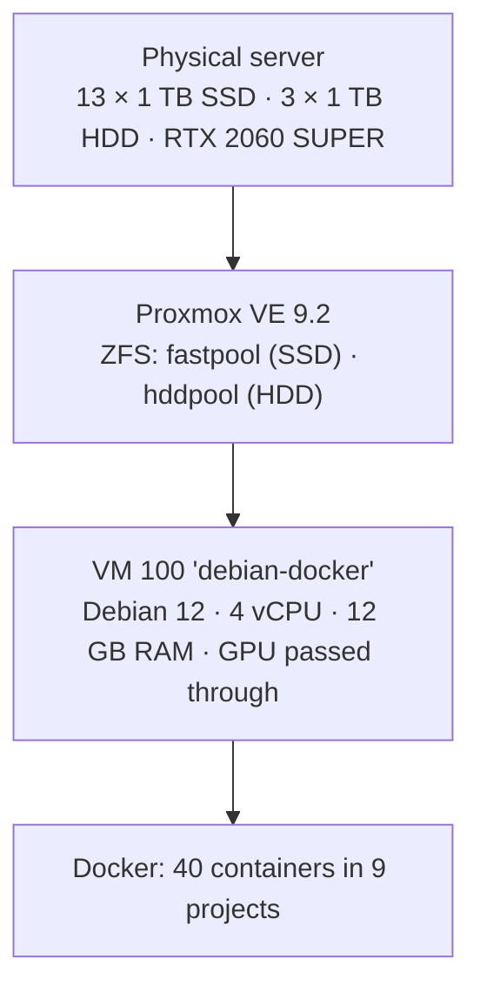
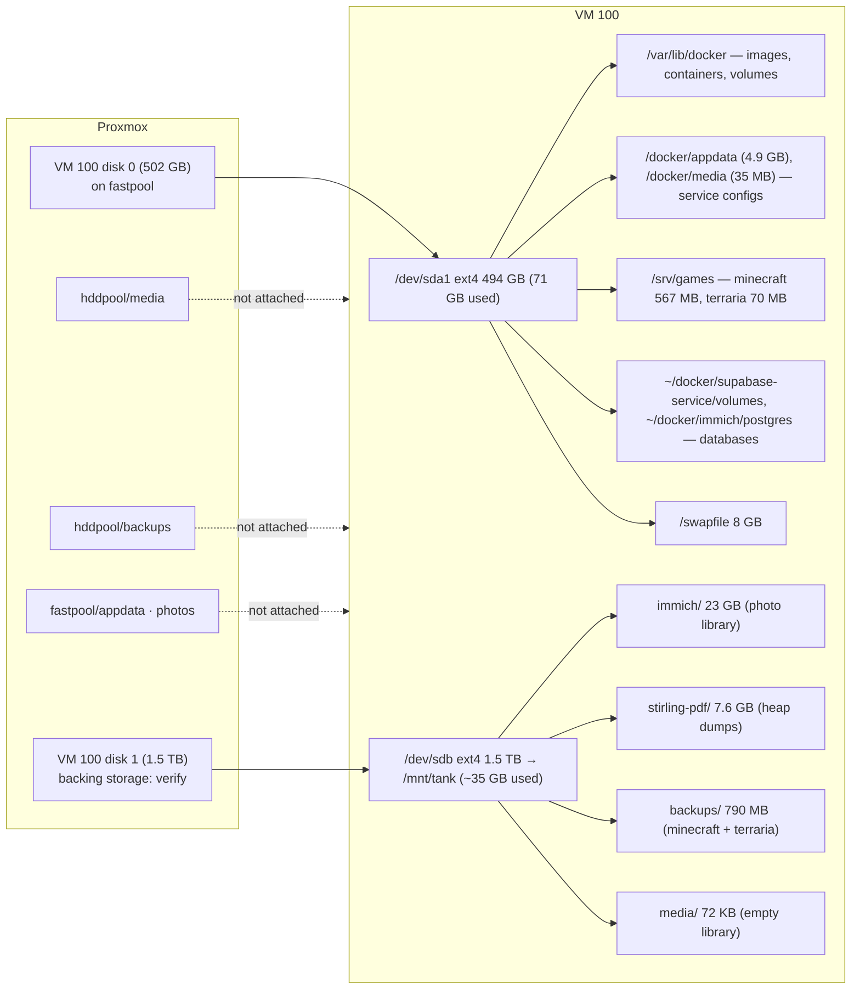

# Host & VM

> The physical Proxmox server and the one Debian VM that runs everything. Last verified 2026-09-25 (from inside the VM). Proxmox-side facts are from the 2026-09-16 inspection unless noted.

## The layers

One VM runs all the Docker containers, rather than one VM or LXC per service. That's a common, sensible homelab design: one OS to patch, one Docker to manage, one GPU owner. The trade-off is that the VM is a single point of failure, which makes VM-level backups important (see the [roadmap](../roadmap/ROADMAP.md)).

## Proxmox host

| Item | Value |
|---|---|
| Proxmox VE | 9.2.x (pve-manager 9.2.4 on 2026-09-16) |
| ZFS `fastpool` | SSD pool, 8.72 TB. Datasets: `appdata`, `photos`, `vms`, and VM 100's boot disk |
| ZFS `hddpool` | HDD pool, 2.72 TB. Datasets: `backups`, `media` (**neither is used by the VM yet**) |
| GPU | NVIDIA RTX 2060 SUPER 8 GB, PCIe passthrough to VM 100 (`vfio-pci` on the host) |
| Backup jobs | **none found** for VM 100 |

To do on the host (the audit script can't see it): record `qm config 100`, `zpool status`, and which storage backs the VM's 1.5 TB second disk.

## VM 100 `debian-docker`

| Item | Value (2026-09-25) |
|---|---|
| OS | Debian 12 (bookworm), kernel 6.1.0-52 |
| Machine | QEMU q35, KVM |
| CPU | 4 vCPU, model "QEMU Virtual CPU 2.5+". Set `cpu: host` so Ollama/Immich ML get AVX |
| RAM | 12 GB, ballooning off, plus an 8 GB swapfile. **Swap was 99 % used** |
| Disks | `sda` 502 GB (boot), `sdb` 1.5 TB (data at `/mnt/tank`). Details below |
| GPU | RTX 2060 SUPER, NVIDIA driver 535 (Ollama needs 550+) |
| QEMU guest agent | **Off on both sides**: the service is inactive *and* Proxmox has the agent option disabled (no virtio channel in the guest). Fix: `qm set 100 --agent 1`, stop/start the VM, then `systemctl enable --now qemu-guest-agent` |
| Uptime | rebooted 2026-09-23 ~12:20 |
| Stability | This boot's kernel log has CPU stall warnings and network-card timeouts: signs the VM is starved of CPU (swap storms and/or an overloaded host) |

### Core services on the VM

| Service | State | What it does |
|---|---|---|
| `docker` / `containerd` | running | Runs all containers |
| `cloudflared` | running | Cloudflare Tunnel: publishes the portfolio site |
| `tailscaled` | running | Private network access to everything |
| `ssh` | running | Remote login (root + password allowed; see security) |
| `cron` | running | Terraria backup (broken path), Tailscale watchdog every 5 min |
| `certbot.timer` + `snap.certbot.renew.timer` | waiting | Certificate renewal. **Two installs**; keep the snap one |
| `playit` | running | Game tunnel agent. **Duplicate** of the `playit` container |
| `qemu-guest-agent` | **inactive** | See above |
| `nginx` (host) | disabled | Old; replaced by the `nginx-proxy` container |
| `avahi-daemon`, `rpcbind` | running | Not needed; can be disabled |

### Host-native programs

Besides Docker, the VM runs a headless browser desktop used by Playwright (browser automation):

- **Xvfb** display `:99` → **x11vnc** on :5900 → **noVNC** (in the browser) on :3010, plus Google Chrome.
- Since 2026-09-25, VNC listens on the **Tailscale IP only** (not the LAN, not IPv6). Start/stop it with `/usr/local/bin/vnc-tailscale.sh [start|stop|status]`. It is **not** started at boot: run it after Xvfb is up.
- Chrome uses ~1 GiB with no limit. The long-term plan is to containerise it with a 1.5 GiB cap and `shm_size: 1gb`. Chrome needs a large `/dev/shm`, and the cap limits it to ~6–8 tabs before a tab (not the browser) is killed.

## Disks and storage

- **Boot disk `sda` (502 GB, 15 % used):** OS, Docker, all databases, app configs, game worlds, swap. It grew from 102 GB after the first inspection, so the old "88 % full" problem is gone.
- **Data disk `sdb` (1.5 TB, ext4 with `discard`, mounted at `/mnt/tank`):** bulk files: Immich photos, Stirling data, media, and the in-VM backups.
- **Not attached:** `hddpool/media`, `hddpool/backups`, `fastpool/photos`, `fastpool/appdata`. There are no ZFS/NFS mounts inside the VM. `/mnt/media` and `/mnt/photos` are empty folders on the boot disk, prepared but never used.

Which path belongs to which app: [services/README.md → Where data lives](../services/README.md#where-data-lives).

### Recommended storage alignment

| Move | To | How | Why |
|---|---|---|---|
| `/mnt/tank/backups` | `hddpool/backups` | NFS export from Proxmox (or a disk on `hddpool`) at `/mnt/backups` | Backups must not live in the same VM (ideally not the same pool) as the data |
| `/mnt/tank/media` | `hddpool/media` | same, at `/mnt/media` | Bulk media belongs on the HDDs |
| `/mnt/tank/immich` | `fastpool/photos` | NFS export or dedicated disk | The dataset was made for this; allows ZFS snapshots of just the photos |
| `/docker`, `/srv/games`, database dirs | `fastpool/appdata` | dedicated disk mounted at `/docker` | Separates app state from the OS for snapshots and restores |
