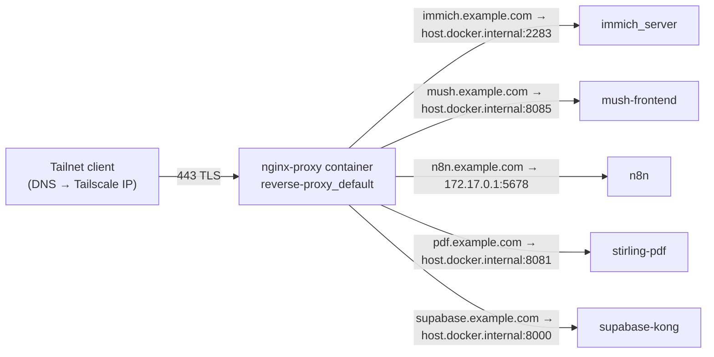
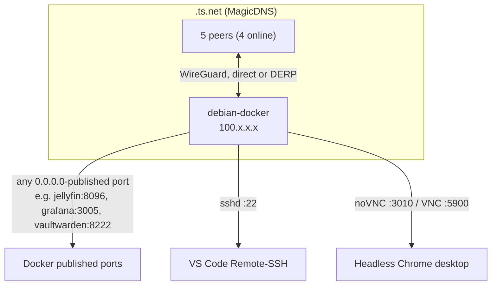

# Networking & Security Architecture

> Last verified 2026-09-25 (audit script + targeted checks) on VM 100 `debian-docker`; first inspection 2026-09-16. Addresses masked: LAN `192.168.x.x/24`, tailnet `100.x.x.x` / `<tailnet>.ts.net`, public domains `*.example.com`, VPN tunnel address `10.x.x.x/32`.

## 1. Network layers

| Layer | Implementation | Address space | Who can reach it |
|---|---|---|---|
| Physical / LAN | Proxmox bridge → VM NIC `enp6s18` (virtio), DHCP | `192.168.x.x/24` + SLAAC IPv6 | Any LAN device |
| Overlay | `tailscaled` 1.102.2, interface `tailscale0`, MagicDNS on, not an exit node, no `serve`/`funnel` | `100.x.x.x/32`, `fd7a:115c:a1e0::/48` | Devices on the tailnet (5 peers, 4 online) |
| Private HTTPS (tailnet) | **`nginx-proxy` container** (`nginx:alpine`, `reverse-proxy` stack) publishing `:80/:443`; certs from host certbot mounted read-only | Public DNS A records for `n8n/immich/pdf/supabase/mush.example.com` point at the VM's **Tailscale IP** (no AAAA). No router port-forward: the home IP does not answer on 443 | Tailnet devices (and the LAN by IP) only. From the internet the names resolve to an unroutable 100.x address |
| Public ingress (HTTP) | **`cloudflared`** systemd service, remotely managed tunnel (token file), 4 edge connections | Apex `example.com` (Cloudflare-proxied) → tunnel → `portfolio-web` :8090 | **Internet: the only public website** |
| Public ingress (games) | Playit.gg agents (outbound UDP tunnel, no port-forward) | Relay-assigned public endpoints | Internet |
| VPN egress | Gluetun → Mullvad WireGuard | Tunnel `10.x.x.x/32` | Only containers sharing Gluetun's netns |
| Container bridges | Docker `bridge` driver, one per Compose project group | see §4 | Containers on the same bridge + host via published ports |

## 2. Ingress and routing flows

### 2.1 Private HTTPS via `nginx-proxy` (tailnet-only by DNS)

| vhost file (`~/docker/reverse-proxy/conf.d/`) | Server name | TLS | Upstream | Verified 2026-09-25 |
|---|---|---|---|---|
| `immich.conf` | `immich.example.com` | 443, 80→301 | `host.docker.internal:2283` | 200 |
| `mush.conf` | `mush.example.com` | 443, 80→301 | `host.docker.internal:8085` | 200 |
| `n8n.conf` | `n8n.example.com` | 443, 80→301 | `172.17.0.1:5678` | 200 |
| `pdf.conf` | `pdf.example.com` | 443, 80→301 (**fixed**, was HTTP-only) | `host.docker.internal:8081` | 200 |
| `supabase.conf` | `supabase.example.com` | 443, 80→301 | `host.docker.internal:8000` (Kong only) | 401 (Kong requires an API key; expected) |

How it is wired:

- nginx runs in its own bridge (`reverse-proxy_default`) and reaches every upstream **through the host**. `host.docker.internal` is mapped to the host gateway in the compose file (`extra_hosts: host-gateway`). The `n8n` vhost uses the literal `docker0` address `172.17.0.1`, which works because the host owns that address even while `docker0` has no attached containers. Change it to `host.docker.internal` for consistency.
- Consequence: every upstream must be **published on the host**, so it is also reachable directly from the LAN and tailnet on its own port and bypasses nginx (see §5). The first inspection's design had upstreams bound to `127.0.0.1`. That property is gone for n8n (now `0.0.0.0:5678`) and never held for the others.
- The Supabase vhost now routes everything to Kong. Studio stays bound to `127.0.0.1:3002` and is no longer publicly routed; reach it over SSH port-forward or Tailscale.
- The host-native nginx package is still installed but `inactive` and `disabled`. Remove it, or leave it disabled so it never races the container for :80/:443.
- `nginx -t` inside the container passes.

**Certificates:** four Let's Encrypt certificates exist: a wildcard (`example.com`, `*.example.com`) plus `mush`, `n8n`, and a `supabase`+`n8n` SAN cert, expiring 2026-11-26 to 2026-12-23. `/etc/letsencrypt` is bind-mounted read-only into `nginx-proxy`. Two certbot installs are present, each with its own renewal timer: apt certbot 2.1.0 (`certbot.timer`) and the snap with `certbot-dns-cloudflare` (`snap.certbot.renew.timer`). Keep the snap, `apt purge certbot`, and after each renewal reload nginx with a deploy hook (`docker exec nginx-proxy nginx -s reload`). Without that hook, the container keeps serving the old certificate until it restarts.

### 2.2 Cloudflare Tunnel

| Property | Value |
|---|---|
| Service | `cloudflared.service` (systemd, enabled), binary `/usr/local/bin/cloudflared` |
| Version | 2026.9.1. The daemon itself logs that 2026.9.3 is available; `cloudflared-update.timer` exists but is **disabled** |
| Mode | Remotely managed: token read from a token file (`--token-file`), not on the command line |
| Ingress rules | Defined in the Cloudflare dashboard (not visible on the VM). Verified from outside on 2026-09-25: the apex `example.com` serves the same content as `portfolio-web` (:8090). No subdomain uses the tunnel |
| Health | `/ready` on `127.0.0.1:20241` reports 4 ready connections |
| Noise | ~20 `timeout: no recent network activity` reconnects and 1 DNS resolver timeout in 24 h. They coincide with the guest's CPU/swap stalls (README §4) rather than a tunnel fault |

**Public exposure model (verified 2026-09-25):** the internet sees exactly three things:

1. The static portfolio on the apex domain, via the tunnel.
2. Minecraft via Playit.
3. Terraria via Playit.

Everything else, including the five nginx vhosts, resolves to the Tailscale IP and needs tailnet membership, or LAN access by raw IP. The home IP is not in DNS and has no port-forwards. To publish another app later, add a tunnel hostname (optionally behind Cloudflare Access) rather than opening router ports.

### 2.3 Tailscale mesh

- The VM advertises no subnet routes and is not an exit node; tailnet peers reach only the VM's own ports. No `serve`/`funnel` configuration.
- MagicDNS gives `debian-docker.<tailnet>.ts.net`; use it instead of the raw `100.x.x.x` address.
- `tailscaled` listens on UDP `41641` and two TCP ports bound to the tailnet addresses only.
- **Watchdog:** root cron every 5 minutes runs `/usr/local/bin/tailscale-watchdog.sh`, which pings `100.100.100.100` and restarts `tailscaled` on failure. The log `/var/log/tailscale-watchdog.log` has not grown since 2026-09-11 (16 lines).
- Tailscale adds its own nftables chains; the host `INPUT` policy is otherwise `ACCEPT` and `DOCKER-USER` is empty (no ufw, no fail2ban).

### 2.4 Game traffic via Playit.gg

Playit establishes an *outbound* UDP session to the relay, so no router port-forward is needed for `25565/tcp` (Minecraft) or `7777/tcp+udp` (Terraria). **Two agents still run:**

| Agent | Where | State (2026-09-25) |
|---|---|---|
| `playit.service` (systemd, host) | `/opt/playit/playitd`, secret in `/etc/playit/playit.toml` | active, enabled, running since boot |
| `playit` container (`gaming` project) | `network_mode: host`, secret inline in the compose file | running since 2026-09-24 |

Both appear in `ss` as `playitd` with 8 ephemeral UDP sockets between them. Keep one (the container is the documented path) and `systemctl disable --now playit`.

## 3. Gluetun VPN network-mode sharing

How it works and why it is safe:

1. `qbittorrent` has **no network interface of its own**. At runtime its network mode is `container:gluetun`, so every socket it opens is inside the VPN namespace.
2. Gluetun's built-in firewall only allows traffic out through `tun0` and to the WireGuard endpoint. If the tunnel drops, qBittorrent's packets are dropped, not leaked over the host NIC: a kill switch by construction.
3. Ports for qBittorrent must be published **on the gluetun service** (they are: `8080`, `6881/tcp+udp`).
4. `depends_on: gluetun` starts qBittorrent after Gluetun. A Gluetun restart recreates the namespace, so run `docker compose up -d` in `media` afterwards to reattach qBittorrent.
5. Other `server-net` containers address qBittorrent as `gluetun:8080`.

Gluetun also exposes but does not publish `8000` (control server), `8888` (HTTP proxy), `8388` (Shadowsocks) and `1080` (SOCKS). They are reachable only from `server-net`.

Secrets involved: `WIREGUARD_PRIVATE_KEY=<YOUR_SECRET>` and `WIREGUARD_ADDRESSES=10.x.x.x/32`. The private key is **still written literally** in `media/docker-compose.yml` (verified 2026-09-25 without printing it). Move it to the project `.env` and reference `${WIREGUARD_PRIVATE_KEY}`.

## 4. Docker networks

| Network | Driver | Subnet | Members | Purpose |
|---|---|---|---|---|
| `server-net` (external, pre-created) | bridge | `172.22.x.x/16` | 20: all of `ai-tools`, `gaming` (except playit), `media`, `management` | Single flat service network so Homepage, Prometheus, the *arr apps and n8n resolve each other by container name |
| `supabase_default` | bridge | `172.18.x.x/16` | 11 | Supabase internal mesh; only Kong, Studio and the pooler publish ports |
| `immich_default` | bridge | `172.21.x.x/16` | 4 | Immich server, ML, Postgres, Valkey |
| `mush_default` | bridge | `172.19.x.x/16` | 1 | mush-frontend |
| `portfolio_default` | bridge | `172.20.x.x/16` | 1 | portfolio-web |
| `reverse-proxy_default` | bridge | `172.23.x.x/16` | 1 | nginx-proxy; reaches upstreams via the host gateway |
| `bridge` (docker0) | bridge | `172.17.x.x/16` | 0 (link down) | Unused default; its gateway address is the n8n upstream |
| `host` | host | — | `playit` | Playit needs raw UDP on the host |

`node_exporter` runs with a read-only bind of `/` at `/host` to read host metrics.

Cross-network communication goes through host-published ports, never shared networks. nginx uses `host.docker.internal`; other containers need the same `extra_hosts: ["host.docker.internal:host-gateway"]` entry, or they must join both networks.

## 5. Port matrix

Observed with `ss -tulpn` and `docker ps` on 2026-09-25. "Bind" is the host address; `0.0.0.0` means reachable from the LAN **and** the tailnet.

### 5.1 Host-native listeners

| Port | Proto | Bind | Process | Purpose | Exposure note |
|---|---|---|---|---|---|
| 22 | tcp | `0.0.0.0` / `[::]` | sshd | Remote dev (VS Code SSH) | Root + password auth enabled |
| 111 | tcp/udp | `0.0.0.0` / `[::]` | rpcbind | NFS client support (no NFS mounts) | Disable until NFS is used |
| 3010 | tcp | tailnet IP only | websockify / noVNC | Browser VNC for headless Chrome | No auth; tailnet-only since 2026-09-25 |
| 5900 | tcp | tailnet IP + `[::1]` | x11vnc `-nopw` | Raw VNC to Xvfb | No password; tailnet-only since 2026-09-25 |
| 5353 | udp | `0.0.0.0` / `[::]` | avahi-daemon | mDNS | Not needed on a server |
| 20241 | tcp | `127.0.0.1` | cloudflared | Tunnel metrics / `/ready` | Loopback only |
| 41641 | udp | `0.0.0.0` / `[::]` | tailscaled | WireGuard | Expected |
| 2 × tcp | tcp | tailnet IPs | tailscaled | Tailscale internals | Tailnet only |
| ephemeral | udp | `0.0.0.0` | playitd ×8, cloudflared ×4 | Outbound tunnel sockets | Expected |
| 68 | udp | `0.0.0.0` | dhclient | DHCP | Expected |
| 37700 | tcp | `127.0.0.1` | bun (claude-mem worker) | Dev tooling | Loopback only |

Host nginx no longer listens; :80/:443 now belong to the `nginx-proxy` container (below).

### 5.2 Docker-published ports

| Host port | Container port | Bind | Container | Stack | Service |
|---|---|---|---|---|---|
| 80, 443 | 80, 443 | `0.0.0.0` | nginx-proxy | reverse-proxy | Public HTTPS entry |
| 2283 | 2283 | `0.0.0.0` | immich_server | immich | Photos (nginx-fronted) |
| 3000 | 3000 | `0.0.0.0` | homepage | management | Dashboard |
| 3001 | 3001 | `0.0.0.0` | uptime-kuma | management | Status monitor |
| 3002 | 3000 | `127.0.0.1` | supabase-studio | supabase | Studio UI (loopback only) |
| 3005 | 3000 | `0.0.0.0` | grafana | management | Dashboards |
| 5000 | 5000 | `0.0.0.0` | kavita | media | Book/comic reader |
| 5299 | 5299 | `0.0.0.0` | lazylibrarian | media | Book automation |
| 5432 | 5432 | `0.0.0.0` | supabase-pooler | supabase | Postgres session mode (Supavisor) |
| 5678 | 5678 | **`0.0.0.0`** (was `127.0.0.1`) | n8n | ai-tools | Automation (nginx-fronted) |
| 6543 | 6543 | `0.0.0.0` | supabase-pooler | supabase | Postgres transaction mode |
| 6881 | 6881 | `0.0.0.0` tcp+udp | gluetun (for qbittorrent) | media | BitTorrent peer port |
| 7777 | 7777 | `0.0.0.0` tcp+udp | terraria | gaming | Game server (also via Playit) |
| 7878 | 7878 | `0.0.0.0` | radarr | media | Movies |
| 8000 | 8000 | `0.0.0.0` | supabase-kong | supabase | Supabase API gateway (nginx-fronted) |
| 8080 | 8080 | `0.0.0.0` | gluetun (for qbittorrent) | media | qBittorrent WebUI |
| 8081 | 8080 | `0.0.0.0` | stirling-pdf | ai-tools | PDF tools (nginx-fronted) |
| 8085 | 80 | `0.0.0.0` | mush-frontend | mush | React SPA (nginx-fronted) |
| 8090 | 80 | `0.0.0.0` | portfolio-web | portfolio | Static portfolio site |
| 8096 | 8096 | `0.0.0.0` | jellyfin | media | Media server HTTP |
| 8222 | 80 | `0.0.0.0` | vaultwarden | management | Password manager |
| 8443 | 8443 | `0.0.0.0` | supabase-kong | supabase | Supabase API gateway (TLS) |
| 8888 | 8080 | `0.0.0.0` | dozzle | management | Container logs (Docker socket, read-only) |
| 8920 | 8920 | `0.0.0.0` | jellyfin | media | Media server HTTPS |
| 8989 | 8989 | `0.0.0.0` | sonarr | media | TV |
| 9090 | 9090 | `0.0.0.0` | prometheus | management | Metrics |
| 9696 | 9696 | `0.0.0.0` | prowlarr | media | Indexers |
| 11434 | 11434 | `0.0.0.0` | ollama | ai-tools | LLM API (unauthenticated) |
| 25565 | 25565 | `0.0.0.0` | minecraft | gaming | Game (also via Playit) |
| 25575 | 25575 | `0.0.0.0` | minecraft | gaming | **RCON** (password-protected admin console) |

Internal-only (exposed, not published): node_exporter `9100`, supabase-db `5432`, supabase-rest `3000`, supabase-meta `8080`, supabase-storage `5000`, supabase-imgproxy `8080`, immich_postgres `5432`, immich_redis `6379`, gluetun `8000/8388/8888/1080`, kong `8001-8004/8444-8447`.

## 6. Security posture

### 6.1 What is done well

- Every public vhost now has valid TLS with an 80→301 redirect (the plain-HTTP `pdf` vhost is fixed).
- The tunnel token is read from a file instead of the unit's command line, so it does not appear in `ps` or `systemctl show`.
- Torrent traffic is namespace-isolated behind a WireGuard kill switch.
- Tailscale provides authenticated remote access without opening SSH to the internet; the watchdog self-heals the daemon.
- Supabase Studio is loopback-only and no longer publicly routed.
- Dozzle mounts the Docker socket read-only; no container runs `--privileged`.
- The docs repo `.gitignore` excludes `.env`, `*.key`, `*.pem`, `secrets/`, `*.log` and audit reports.

### 6.2 Findings and recommended fixes

| # | Severity | Finding (2026-09-25) | Fix |
|---|---|---|---|
| 1 | High | `sshd`: `PermitRootLogin yes`, `PasswordAuthentication yes`, `X11Forwarding yes`, no `authorized_keys` for root, no fail2ban | Add a key, then set `PasswordAuthentication no`, `PermitRootLogin prohibit-password`; install fail2ban or rely on Tailscale-only SSH. |
| 2 | ~~High~~ Fixed 2026-09-25 | `x11vnc -nopw` and noVNC were on all interfaces including public IPv6 | Now started by `/usr/local/bin/vnc-tailscale.sh`: x11vnc `-listen <tailscale-ip> -listenv6 ::1`, websockify on `<tailscale-ip>:3010`. Verified refused on LAN and public IPv6. Still no VNC password (accepted: tailnet is single-user). |
| 3 | Medium (LAN/tailnet only) | No host firewall: `INPUT` policy `ACCEPT`, `DOCKER-USER` empty, while Ollama `11434` (no auth), RCON `25575`, Postgres `5432/6543`, Kong `8000/8443`, qBittorrent `8080` and 20+ admin UIs listen on all interfaces | Bind non-public services to `127.0.0.1` or the tailnet IP in Compose, **or** add `DOCKER-USER` rules that allow only `tailscale0` + the LAN subnet (Docker-published ports bypass `INPUT`). |
| 4 | Low | n8n regressed from `127.0.0.1:5678` to `0.0.0.0:5678`, bypassing nginx/TLS on the LAN | Restore `"127.0.0.1:5678:5678"`; nginx reaches it via the host gateway either way. |
| 5 | Medium | `homepage` mounts the Docker socket **read-write** | Add `:ro`. |
| 6 | Medium | Secrets written literally in compose files: Gluetun `WIREGUARD_PRIVATE_KEY` (`media`), Minecraft/mc-backup `RCON_PASSWORD` and Playit `SECRET_KEY` (`gaming`) | Move to each project's `.env`, reference as `${VAR}`. |
| 7 | Medium | All `.env` files are mode `644` (world-readable), including Supabase's ~20 key-material values | `chmod 600` every `.env` under `~/docker` and `~/Mush`. |
| 8 | Medium | Vaultwarden `SIGNUPS_ALLOWED=true` on a LAN/tailnet-reachable port | Set `false` once accounts exist. |
| 9 | Medium | 40 pending apt updates, no `unattended-upgrades`; cloudflared outdated with its update timer disabled | `apt install unattended-upgrades`; `systemctl enable --now cloudflared-update.timer`. |
| 10 | Medium | Duplicate Playit agents (host + container) | `systemctl disable --now playit`. |
| 11 | Low | Two certbot installs with two renewal timers, no nginx reload hook | Keep one; add a deploy hook that reloads `nginx-proxy`. |
| 12 | Low | avahi and rpcbind listening with no consumer | `systemctl disable --now avahi-daemon rpcbind`. |
| 13 | Medium | Minecraft is public via Playit with `online-mode=true` but **no whitelist** (0 entries, `enforce-whitelist=false`) and no ops | Set `ENABLE_WHITELIST=true`, `ENFORCE_WHITELIST=true` and `WHITELIST=<names>` in the `gaming` compose, then recreate. |
| 14 | Medium | Terraria is public via Playit with **no server password** | Add `password=<YOUR_SECRET>` to `serverconfig.txt` (or the image's password variable). |
| 15 | Low | Confirm in the Playit dashboard that only 25565 and 7777 are tunnelled, not RCON 25575 | Delete any other tunnels. |
| 16 | Info | Accounts that control everything: the Tailscale login (joins the tailnet), the Cloudflare account and the Cloudflare API token in `~/docker/.env` (DNS + tunnel) | 2FA on both identity providers; scope the API token to `Zone:DNS:Edit` on one zone; `chmod 600` the `.env`; review the 5 tailnet devices. |

### 6.3 Token scrubbing rules for this documentation

Apply on every update:

1. **Never copy values** of any variable whose name contains `PASSWORD`, `PASS`, `SECRET`, `TOKEN`, `KEY`, `JWT`, `AUTHKEY`, `PRIVATE`, `ENC`; write `<YOUR_SECRET>`.
2. **Public and overlay addresses:** LAN → `192.168.x.x`, Tailscale → `100.x.x.x` / `<tailnet>.ts.net`, VPN tunnel → `10.x.x.x`, public IPv4/IPv6 never written.
3. **Domains:** real hostnames → `service.example.com`; certificate names → the same placeholder. The domain's first label is also a personal name, so treat it like a domain everywhere, including paths such as `/home/<user>`.
4. **People:** login names and home directories → `<user>`; never write real names.
5. **Docker bridge subnets** may be written with the last two octets masked (`172.22.x.x/16`); container IPs are never listed.
6. **Compose files are summarised, never reproduced.** Only image, ports, limits, mounts and non-secret environment keys are documented.
7. Source material comes from [`scripts/audit-homelab.sh`](../scripts/audit-homelab.sh) (redacted, host-masked by default). Its reports are gitignored and must never be committed. Run the leak check in the README (§5) before every commit.
8. The docs repo `.gitignore` must keep `.env`, `*.key`, `*.pem`, `secrets/`, `*.log` and the audit report patterns.
