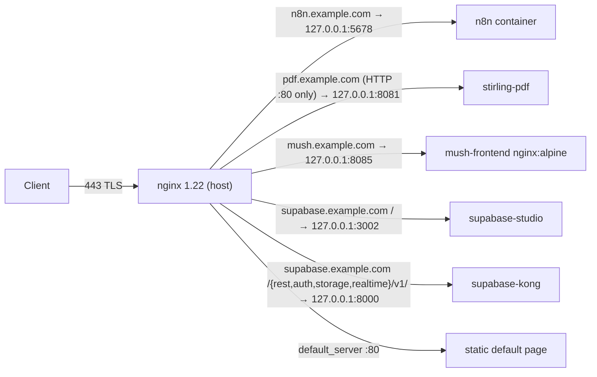
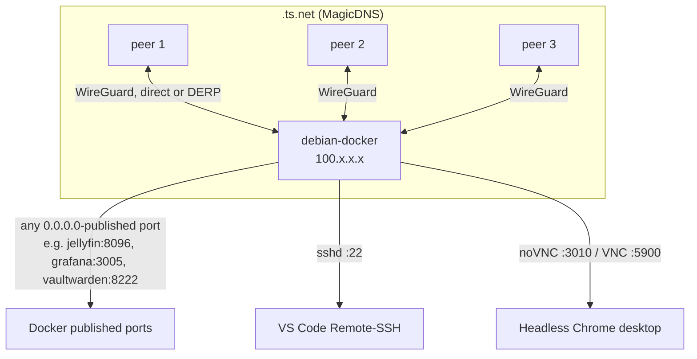
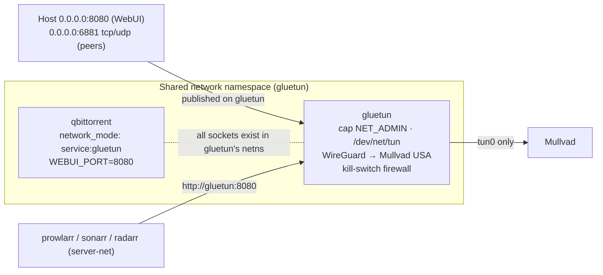

# Networking & Security Architecture

> Live inspection of VM 100 `debian-docker`, 2026-09-16. Addresses masked: LAN `192.168.x.x/24`, tailnet `100.x.x.x` / `<tailnet>.ts.net`, public domains `*.example.com`, VPN tunnel address `10.x.x.x/32`.

## 1. Network layers

| Layer | Implementation | Address space | Who can reach it |
|---|---|---|---|
| Physical / LAN | Proxmox bridge → VM NIC `enp6s18` (virtio), DHCP | `192.168.x.x/24` + SLAAC IPv6 | Any LAN device |
| Overlay | `tailscaled` 1.102.2, interface `tailscale0`, MagicDNS on, not an exit node, no `serve`/`funnel` | `100.x.x.x/32`, `fd7a:115c:a1e0::/48` | Devices on the tailnet (3 peers) |
| Public ingress (HTTP) | Host-native nginx 1.22 on `:80/:443`, Let's Encrypt certs via certbot snap + Cloudflare DNS-01 | Public DNS `*.example.com` → router port-forward (80/443) | Internet |
| Public ingress (games) | Playit.gg agent (outbound UDP tunnel, no port-forward) | Relay-assigned public endpoints | Internet |
| VPN egress | Gluetun → Mullvad WireGuard, `SERVER_COUNTRIES=USA` | Tunnel `10.x.x.x/32` | Only containers sharing Gluetun's netns |
| Container bridges | Docker `bridge` driver, one per Compose project group | see §4 | Containers on the same bridge + host via published ports |

## 2. Ingress and routing flows

### 2.1 Public HTTPS via nginx

| vhost file | Server name | TLS | Upstream | Notable directives |
|---|---|---|---|---|
| `sites-enabled/n8n` | `n8n.example.com` | 443, 80→301 | `127.0.0.1:5678` | `client_max_body_size 100M`; n8n itself binds **loopback only** |
| `sites-enabled/pdf` | `pdf.example.com` | **80 only, no redirect, no cert** | `127.0.0.1:8081` | `client_max_body_size 100M` — uploads travel in clear text |
| `sites-enabled/mush` | `mush.example.com` | 443, 80→301 | `127.0.0.1:8085` | Static SPA |
| `sites-enabled/supabase` | `supabase.example.com` | 443, 80→301 | `127.0.0.1:3002` (Studio) and `127.0.0.1:8000` (Kong API) | Regex location for the four Supabase API prefixes; CORS pre-flight answered with 204 |
| `sites-enabled/default` | `_` | 80 | local html | Catch-all |

Three Let's Encrypt certificates are managed by the certbot snap (`certbot-dns-cloudflare` plugin). Renewal runs from `certbot.timer`; the Cloudflare API token lives in `~/docker/.env` and the certbot credentials file (never in the docs).

**Design property:** every upstream is `127.0.0.1`, so nginx is the sole public entry point for HTTP workloads and the containers' own published ports are not what the internet hits. However, the same ports are also bound on `0.0.0.0` (see §5), so nginx is *not* the only path from the LAN or tailnet.

### 2.2 Tailscale mesh

- The VM advertises no subnet routes and is not an exit node, so it is a plain node: tailnet peers reach only the VM's own ports.
- MagicDNS gives `debian-docker.<tailnet>.ts.net`; use it in VS Code Remote-SSH and browser bookmarks instead of the raw `100.x.x.x` address.
- `tailscaled` listens on UDP `41641` (direct WireGuard) and an ephemeral TCP port on the tailnet address.
- **Watchdog:** root cron every 5 minutes runs `/usr/local/bin/tailscale-watchdog.sh`, which pings the Tailscale DNS resolver `100.100.100.100` three times and, on failure, restarts `tailscaled`, sleeps 5 s, then `tailscale up`. Log: `/var/log/tailscale-watchdog.log` (16 lines, last two triggers on 2026-09-11 22:50 and 22:55 PDT).
- Tailscale installs its own nftables chains (`ts-input`, `ts-forward`); the host `INPUT` chain is otherwise `ACCEPT` with no other firewall (no ufw, no fail2ban).

### 2.3 Game traffic via Playit.gg

Playit establishes an *outbound* UDP session to the relay, and the relay forwards player traffic back through it, so no router port-forward is needed for `25565/tcp` (Minecraft) or `7777/tcp+udp` (Terraria). Two agents currently run:

| Agent | Where | Config |
|---|---|---|
| `playit.service` (systemd, user `playit`) | host, `/opt/playit/playitd`, secret at `/etc/playit/playit.toml` | 8 ephemeral UDP sockets observed |
| `playit` container (`gaming` project) | `network_mode: host`, `SECRET_KEY=<YOUR_SECRET>` | same host netns |

Running both is redundant and can cause tunnel flapping if they carry the same agent secret. Keep one (the container is the documented path in the `gaming` stack) and disable the other.

## 3. Gluetun VPN network-mode sharing

How it works and why it is safe:

1. `qbittorrent` has **no network interface of its own**. Docker attaches it to Gluetun's namespace (`net=container:<gluetun-id>` in `docker inspect`), so every socket qBittorrent opens is inside the VPN namespace.
2. Gluetun's built-in firewall only allows traffic out through `tun0` and to the WireGuard endpoint. If the tunnel drops, qBittorrent's packets are dropped, not leaked over the host NIC — a kill switch by construction.
3. Ports for qBittorrent must be published **on the gluetun service** (they are: `8080`, `6881/tcp+udp`). Publishing them on qbittorrent is impossible because it has no namespace of its own.
4. `depends_on: gluetun: condition: service_healthy` means qBittorrent does not start until Gluetun's healthcheck (a VPN-side connectivity probe) passes; a Gluetun restart also recreates the namespace, so qBittorrent must be restarted with it (`docker compose up -d` handles this).
5. Other `server-net` containers address qBittorrent as `gluetun:8080` — the DNS name of the namespace owner — not `qbittorrent:8080`.

Gluetun also exposes but does not publish `8000` (control server), `8888` (HTTP proxy), `8388` (Shadowsocks) and `1080` (SOCKS). They are reachable only from `server-net`.

Secrets involved: `WIREGUARD_PRIVATE_KEY=<YOUR_SECRET>` and the Mullvad-assigned `WIREGUARD_ADDRESSES=10.x.x.x/32`. Both currently sit inline in `media/docker-compose.yml`; move them to the project `.env` (git-ignored) to match the rest of the stack.

## 4. Docker networks

| Network | Driver | Subnet | Members | Purpose |
|---|---|---|---|---|
| `server-net` (external, pre-created) | bridge | `172.22.x.x/16` | 19 — all of `ai-tools`, `gaming`, `media`, `management` | Single flat service network so Homepage, Prometheus, the *arr apps and n8n resolve each other by container name |
| `supabase_default` | bridge | `172.18.x.x/16` | 11 | Supabase internal mesh; only Kong, Studio and the pooler publish ports |
| `mush_default` | bridge | `172.19.x.x/16` | 1 | mush-frontend |
| `bridge` (docker0) | bridge | `172.17.x.x/16` | 0 (link down) | Unused default |
| `host` | host | — | `playit` | Playit needs raw UDP on the host |

`node_exporter` additionally runs with `pid: host` and a read-only bind of `/` to read host metrics; it stays on `server-net`.

Cross-network communication (e.g. n8n → Supabase REST) must go via a host-published port (`host.docker.internal` is not configured; use the LAN/tailnet IP or `172.22.0.1` gateway) or by attaching the container to both networks.

## 5. Port matrix

All bindings observed with `ss -tulpn` and `docker ps`. "Bind" is the host address; `0.0.0.0` means LAN **and** tailnet reachable.

### 5.1 Host-native listeners

| Port | Proto | Bind | Process | Purpose | Exposure note |
|---|---|---|---|---|---|
| 22 | tcp | `0.0.0.0` / `[::]` | sshd | Remote dev (VS Code SSH) | Root + password auth enabled |
| 80 | tcp | `0.0.0.0` / `[::]` | nginx | HTTP vhosts + redirects | Router forward → public |
| 443 | tcp | `0.0.0.0` / `[::]` | nginx | HTTPS vhosts | Router forward → public |
| 111 | tcp/udp | `0.0.0.0` / `[::]` | rpcbind | NFS client support (no exports mounted) | Can be disabled until NFS is used |
| 3010 | tcp | `0.0.0.0` | websockify / noVNC | Browser VNC for headless Chrome | No auth |
| 5900 | tcp | `0.0.0.0` / `[::]` | x11vnc `-nopw` | Raw VNC to Xvfb `:99` | **No password** |
| 5353 | udp | `0.0.0.0` / `[::]` | avahi-daemon | mDNS | Not needed on a server |
| 41641 | udp | `0.0.0.0` / `[::]` | tailscaled | WireGuard | Expected |
| ephemeral ×8 | udp | `0.0.0.0` | playitd (host) | Playit relay tunnel | Expected |
| 68 | udp | `0.0.0.0` | dhclient | DHCP | Expected |
| 37700 | tcp | `127.0.0.1` | bun (claude-mem worker) | Dev tooling | Loopback only |

### 5.2 Docker-published ports

| Host port | Container port | Bind | Container | Stack | Service |
|---|---|---|---|---|---|
| 3000 | 3000 | `0.0.0.0` | homepage | management | Dashboard |
| 3001 | 3001 | `0.0.0.0` | uptime-kuma | management | Status monitor |
| 3002 | 3000 | `127.0.0.1` | supabase-studio | supabase | Studio UI (nginx-fronted) |
| 3005 | 3000 | `0.0.0.0` | grafana | management | Dashboards |
| 5000 | 5000 | `0.0.0.0` | kavita | media | Book/comic reader |
| 5299 | 5299 | `0.0.0.0` | lazylibrarian | media | Book automation |
| 5432 | 5432 | `0.0.0.0` | supabase-pooler | supabase | Postgres session mode (Supavisor) |
| 5678 | 5678 | `127.0.0.1` | n8n | ai-tools | Automation (nginx-fronted) |
| 6543 | 6543 | `0.0.0.0` | supabase-pooler | supabase | Postgres transaction mode |
| 6881 | 6881 | `0.0.0.0` tcp+udp | gluetun (for qbittorrent) | media | BitTorrent peer port |
| 7777 | 7777 | `0.0.0.0` tcp+udp | terraria | gaming | Game server (also via Playit) |
| 7878 | 7878 | `0.0.0.0` | radarr | media | Movies |
| 8000 | 8000 | `0.0.0.0` | supabase-kong | supabase | Supabase API gateway (HTTP) |
| 8080 | 8080 | `0.0.0.0` | gluetun (for qbittorrent) | media | qBittorrent WebUI |
| 8081 | 8080 | `0.0.0.0` | stirling-pdf (stopped) | ai-tools | PDF tools (nginx-fronted) |
| 8085 | 80 | `0.0.0.0` | mush-frontend | mush | React SPA (nginx-fronted) |
| 8096 | 8096 | `0.0.0.0` | jellyfin | media | Media server HTTP |
| 8222 | 80 | `0.0.0.0` | vaultwarden | management | Password manager |
| 8443 | 8443 | `0.0.0.0` | supabase-kong | supabase | Supabase API gateway (TLS) |
| 8888 | 8080 | `0.0.0.0` | dozzle | management | Container logs (Docker socket, read-only) |
| 8920 | 8920 | `0.0.0.0` | jellyfin | media | Media server HTTPS |
| 8989 | 8989 | `0.0.0.0` | sonarr | media | TV |
| 9090 | 9090 | `0.0.0.0` | prometheus | management | Metrics |
| 9696 | 9696 | `0.0.0.0` | prowlarr | media | Indexers |
| 11434 | 11434 | `0.0.0.0` | ollama | ai-tools | LLM API (unauthenticated) |
| 25565 | 25565 | `0.0.0.0` | minecraft | gaming | Game (also via Playit) |
| 25575 | 25575 | `0.0.0.0` | minecraft | gaming | **RCON** (password-protected admin console) |

Internal-only (exposed, not published): node_exporter `9100`, supabase-db `5432`, supabase-rest `3000`, supabase-meta `8080`, supabase-storage `5000`, supabase-imgproxy `8080`, gluetun `8000/8388/8888/1080`, kong `8001-8004/8444-8447`.

## 6. Security posture

### 6.1 What is done well

- Public HTTP surface is confined to nginx with valid TLS on three vhosts; n8n and Supabase Studio bind loopback only, so they cannot be reached except through nginx.
- Torrent traffic is namespace-isolated behind a WireGuard kill switch; the VPN key is the only way out.
- Tailscale provides authenticated, encrypted remote access without opening SSH to the internet, and a watchdog self-heals the daemon.
- Secrets for the four home-grown stacks are mostly externalised to git-ignored `.env` files; the docs repo `.gitignore` excludes `.env`, `*.key`, `*.pem`, `secrets/`.
- Dozzle mounts the Docker socket read-only; the `management` stack uses named volumes for Prometheus/Grafana state.
- No kernel OOM kills, healthchecks on critical services, `unless-stopped` everywhere.

### 6.2 Findings and recommended fixes

| # | Severity | Finding | Fix |
|---|---|---|---|
| 1 | High | `sshd`: `PermitRootLogin yes`, `PasswordAuthentication yes`, no `authorized_keys` for root | Add keys, then set `PasswordAuthentication no`, `PermitRootLogin prohibit-password`; consider `AllowUsers`. |
| 2 | High | `x11vnc -nopw` on `0.0.0.0:5900` and noVNC on `0.0.0.0:3010` | Bind both to `127.0.0.1` (or the tailscale IP) and add `-rfbauth`; reach them over Tailscale only. |
| 3 | High | Ollama API `11434` unauthenticated on all interfaces; RCON `25575`, Postgres `5432/6543`, Kong `8000` on all interfaces | Bind to `127.0.0.1` or `100.x.x.x` in Compose (`"127.0.0.1:11434:11434"`), or add an nftables input policy allowing only `tailscale0` + selected LAN ports. |
| 4 | Medium | `pdf.example.com` served over plain HTTP with 100 MB uploads | Add a cert and 80→443 redirect like the other vhosts. |
| 5 | Medium | `homepage` mounts the Docker socket **read-write**; `dozzle` read-only | Change to `:ro`; Homepage only needs list/inspect. |
| 6 | Medium | Gluetun WireGuard private key and Minecraft/Playit secrets are inline in compose files | Move to `.env`, reference as `${VAR}`. |
| 7 | Medium | Vaultwarden `SIGNUPS_ALLOWED=true` on a LAN/tailnet-reachable port | Set `false` after creating accounts; front with nginx + TLS if it must be public. |
| 8 | Medium | Duplicate Playit agents (host + container) | Disable `playit.service` or remove the container. |
| 9 | Low | avahi and rpcbind listening with no consumer | `systemctl disable --now avahi-daemon rpcbind` until NFS is mounted. |
| 10 | Low | Supabase `.env` holds ~20 distinct key material items in one file | Restrict to `chmod 600 root:root`, exclude from any sync, rotate `JWT_SECRET` if it was ever committed. |

### 6.3 Token scrubbing rules for this documentation

Applied when generating these files and to be followed on every update:

1. **Never copy values** of any variable whose name contains `PASSWORD`, `PASS`, `SECRET`, `TOKEN`, `KEY`, `JWT`, `AUTHKEY`, `PRIVATE`, `ENC` — write `<YOUR_SECRET>`.
2. **Public and overlay addresses:** LAN → `192.168.x.x`, Tailscale → `100.x.x.x` / `<tailnet>.ts.net`, VPN tunnel → `10.x.x.x`, public IPv4/IPv6 never written.
3. **Domains:** real hostnames → `service.example.com`; certificate names → same placeholder.
4. **Docker bridge subnets** may be written with the last two octets masked (`172.22.x.x/16`); container IPs are never listed.
5. **Compose files are summarised, never reproduced.** Only image, ports, limits, mounts and non-secret environment keys are documented.
6. The `generate_snapshot.sh` helper in `/root` already greps out `PASSWORD|SECRET|TOKEN|KEY|PASS|AUTH` and replaces `=value` with `=<REDACTED>`; reuse it for future snapshots and review its output before committing.
7. The docs repo `.gitignore` must keep `.env`, `*.key`, `*.pem`, `secrets/`, `*.log`.
