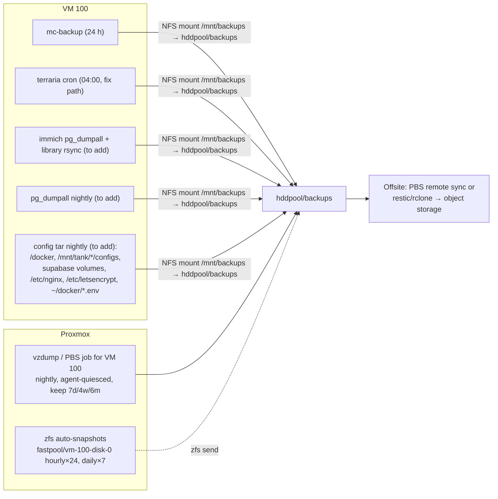

# Disaster Recovery Runbook

> Covers: Proxmox host loss, ZFS pool re-import, VM 100 loss, Docker stack and per-service data recovery, backup validation.
> Based on the 2026-09-16 inspection, re-verified 2026-09-25 with `scripts/audit-homelab.sh`. Placeholders: `<PVE_LAN_IP>` = `192.168.x.x`, secrets = `<YOUR_SECRET>`, domains = `*.example.com`.

## 0. Recovery objectives and current reality

| Asset | Where it lives today | Protection in place | Effective RPO | Effective RTO |
|---|---|---|---|---|
| Proxmox host OS | PVE boot device | none observed from the guest | rebuild from ISO | ~1 h |
| ZFS pools `fastpool` (8.72 TB), `hddpool` (2.72 TB) | SSD + HDD | pool redundancy (verify vdev layout with `zpool status`) | n/a | `zpool import` minutes |
| VM 100 boot disk (502 GB, `/dev/sda`) | fastpool | **no PBS/vzdump job detected**; QEMU guest agent inactive | undefined | reinstall 2–4 h |
| VM 100 data disk (1.5 TB, `/dev/sdb` → `/mnt/tank`) | backing storage unverified (`qm config 100`) | none | undefined | — |
| Minecraft world | `/srv/games/minecraft` (boot disk) | mc-backup daily, 7 kept, on `/mnt/tank/backups` (other virtual disk, same VM) | ≤ 24 h | 10 min |
| Terraria world | `/srv/games/terraria` (boot disk) | root cron 04:00 **archives the old, missing path since 2026-09-24**; last good archive 2026-09-24 | stale, growing | 10 min from the last good archive |
| Immich library (23 GB) | `/mnt/tank/immich` | **none** | total loss | n/a |
| Immich database | `~/docker/immich/postgres` (boot disk) | **none** | total loss | n/a |
| Supabase Postgres | `~/docker/supabase-service/volumes/db/data` | **none** | total loss | n/a |
| Vaultwarden vault | `/docker/media/config/vaultwarden` | **none** | total loss | n/a |
| n8n workflows/credentials | `/docker/appdata/n8n` | **none** | total loss | n/a |
| *arr / Jellyfin / Kavita configs | `/docker/media/config/*` | none | rebuild | 1–2 h |
| Ollama models, Docker images | boot disk | none needed (re-downloadable) | — | bandwidth-bound (~45 GB) |
| TLS certs, proxy vhosts, tunnel token, Tailscale identity | `/etc/letsencrypt`, `~/docker/reverse-proxy/conf.d`, `/etc/cloudflared`, `/var/lib/tailscale` | none | re-issue / re-auth | 30–60 min |

**Bottom line:** losing VM 100 today loses the Immich photo library and database, the Supabase database, the password vault, the automation credentials and every game backup at once. All in-guest backups live inside the same VM. Section 5 fixes that; sections 1–4 tell you how to get back when it happens.

## 1. Bare-metal Proxmox rebuild

Use when the hypervisor boot device or the whole node is lost but the ZFS disks survive.

### 1.1 Prerequisites to have stored off-box (checklist)

- [ ] Proxmox ISO matching `pve-manager 9.2.x` (or newer 9.x) on USB.
- [ ] `/etc/pve` backup (`tar czf pve-config.tgz /etc/pve /etc/network/interfaces /etc/hosts /etc/modprobe.d /etc/default/grub` taken on the host) — contains `qemu-server/100.conf`, `storage.cfg`, user/ACL config.
- [ ] Output of `zpool status`, `zpool list -v`, `zfs list -o name,mountpoint,used`, `zfs get all fastpool/vm-100-disk-0 | grep volsize` saved as text.
- [ ] IOMMU/passthrough notes: PCI ID of the RTX 2060 SUPER (`lspci -nn | grep -i nvidia` on the host), the `vfio-pci` ids line, and the VM's `hostpci0:` entry.
- [ ] Tailscale auth key or admin console access; Cloudflare API token (`<YOUR_SECRET>`); Playit agent secret; Mullvad WireGuard key.

### 1.2 Install and re-import pools

1. Install Proxmox from ISO onto the **boot device only**. Do not let the installer touch the NVMe or HDD members of `fastpool` / `hddpool`. If the installer offers ZFS on the boot device, that is fine; it creates `rpool`, which is separate.
2. First boot: set the management IP to the old `<PVE_LAN_IP>` so the VM's DHCP lease and any NFS exports keep working.
3. Re-import the data pools. `-f` is needed because the pools were last imported by a different host id:

   ```bash
   zpool import                       # lists importable pools; confirm fastpool and hddpool are visible
   zpool import -f fastpool
   zpool import -f hddpool
   zpool status -v                    # all vdevs ONLINE, no errors
   zfs list -r fastpool hddpool       # expect fastpool/appdata, fastpool/photos, fastpool/vms,
                                      # fastpool/vm-100-disk-0 (zvol), hddpool/backups, hddpool/media
   zpool set cachefile=/etc/zfs/zpool.cache fastpool
   zpool set cachefile=/etc/zfs/zpool.cache hddpool
   update-initramfs -u -k all         # so pools import at boot
   ```

   If a pool shows `DEGRADED`, do **not** start VMs; replace the failed member first (`zpool replace <pool> <old> <new>`), let the resilver finish, then continue.
4. Re-register storage in Proxmox so the zvol is usable (Datacenter → Storage, or restore `storage.cfg`):
   - `zfspool: fastpool` with `pool fastpool`, content `images,rootdir`.
   - `zfspool: hddpool` or a `dir` storage on `/hddpool/backups` with content `backup` for vzdump targets.
5. Restore `/etc/pve/qemu-server/100.conf` from the config backup. If it is lost, recreate VM 100 with these known parameters:

   | Setting | Value |
   |---|---|
   | VMID / name | 100 / `debian` (guest hostname `debian-docker`) |
   | Machine | `q35` (guest reports `pc-q35-11.0`), OVMF/UEFI recommended for GPU passthrough |
   | CPU | 4 cores (guest sees `QEMU Virtual CPU version 2.5+`; use `cpu: host` for AVX in Ollama/Immich ML) |
   | Memory | 12288 MB today, ballooning off (`virtio_balloon` not loaded in the guest). **Raise to 16–20 GB** when rebuilding (swap was full on 2026-09-25) |
   | Disks | `scsi0`: boot zvol on `fastpool` (502 GB); `scsi1`: 1.5 TB data disk for `/mnt/tank` (record its storage ID from `qm config 100` **now**, while the host is healthy). VirtIO SCSI, `discard=on`, `ssd=1` |
   | NIC | `virtio`, bridge `vmbr0` (guest interface `enp6s18`) |
   | Display | default (Virtio GPU) plus `hostpci0: <nvidia-pci-id>,pcie=1` for the RTX 2060 SUPER |
   | Agent | `agent: 1`. **Currently off**: the guest has no `org.qemu.guest_agent.0` port, so enabling the service alone is not enough. Set it on the host, stop/start the VM, then `systemctl enable --now qemu-guest-agent` |
   | Boot | `order=scsi0` |

6. Re-enable passthrough on the host: IOMMU in `/etc/default/grub` (`intel_iommu=on` or `amd_iommu=on iommu=pt`), `vfio vfio_iommu_type1 vfio_pci` in `/etc/modules`, blacklist `nouveau`/`nvidia` on the host, `update-grub && update-initramfs -u`, reboot, confirm the card is bound to `vfio-pci` (`lspci -k`).
7. Start VM 100. Verify from the guest: `lspci | grep -i nvidia`, `nvidia-smi`, `df -h /`, `docker ps`.

### 1.3 If the zvol itself is intact but the VM won't boot

Boot the VM from a Debian live ISO, `fsck.ext4 -f /dev/sda1`, mount it, chroot, `update-grub`. The most likely causes after a hypervisor rebuild are a changed disk bus (SCSI → SATA) or a missing UEFI boot entry.

## 2. VM 100 restoration

### 2.1 Preferred path: restore from PBS / vzdump (once §5.1 is implemented)

```bash
# On PVE
pvesm list <backup-storage>                       # find the newest vzdump-qemu-100-*.vma.zst or PBS snapshot
qmrestore <archive-or-pbs-path> 100 --storage fastpool --unique 0
qm set 100 --hostpci0 <nvidia-pci-id>,pcie=1      # passthrough is not always preserved
qm start 100
```

Then inside the guest: `systemctl status docker tailscaled cloudflared`, `docker compose ls`, and continue with §2.3 verification.

### 2.2 Fallback path: rebuild the guest from scratch

Only when no VM backup exists. Order matters; each step depends on the previous.

1. **Base OS:** Debian 12 netinst, hostname `debian-docker`, ext4 root ≥ 500 GB on `fastpool`; format the data disk as ext4 and mount it at `/mnt/tank` (`/dev/sdb /mnt/tank ext4 defaults,discard 0 2`); 8 GB swapfile (`fallocate -l 8G /swapfile && chmod 600 /swapfile && mkswap /swapfile && swapon /swapfile`, add to fstab). Install `qemu-guest-agent nfs-common curl gnupg ca-certificates`. Enable `qemu-guest-agent`.
2. **NVIDIA driver:** for Ollama CUDA support install **≥ 550** (bookworm-backports `nvidia-driver` or NVIDIA's CUDA repo), not the 535 currently installed. Then `nvidia-container-toolkit` from NVIDIA's apt repo, `nvidia-ctk runtime configure --runtime=docker`, which writes the `nvidia` runtime into `/etc/docker/daemon.json`. Reboot, check `nvidia-smi`.
3. **Docker:** Docker CE from `download.docker.com` (engine 29.x, compose plugin 5.x). Create the shared bridge before any stack: `docker network create server-net`.
4. **Tailscale:** install from `pkgs.tailscale.com`, `tailscale up` (or `--auth-key=<YOUR_SECRET>`), confirm MagicDNS name resolves. Reinstate the watchdog: copy `tailscale-watchdog.sh` to `/usr/local/bin/`, `chmod +x`, add the `*/5` root cron line.
5. **Certificates, reverse proxy and tunnel:**
   - `snap install certbot && snap set certbot trust-plugin-with-root=ok && snap install certbot-dns-cloudflare` (use the snap only; do not also install apt `certbot`).
   - Write `/root/.secrets/cloudflare.ini` with `dns_cloudflare_api_token = <YOUR_SECRET>` (`chmod 600`).
   - Issue certificates: `certbot certonly --dns-cloudflare --dns-cloudflare-credentials /root/.secrets/cloudflare.ini -d example.com -d '*.example.com'`. One wildcard covers every vhost.
   - Add a deploy hook: `/etc/letsencrypt/renewal-hooks/deploy/reload-nginx.sh` containing `docker exec nginx-proxy nginx -s reload`.
   - nginx runs as a container: restore `~/docker/reverse-proxy` (compose + `conf.d/*.conf`). It is started in step 7.
   - **Cloudflare Tunnel:** install `cloudflared`, restore the tunnel token to `/etc/cloudflared/token` (`chmod 600`) and install the unit with `--token-file`. Ingress rules come back automatically from the Cloudflare dashboard. `systemctl enable --now cloudflared cloudflared-update.timer`.

6. **Directories:** recreate the bind-mount tree with the ownership the containers expect:

   ```bash
   mkdir -p /srv/games/{minecraft/data,terraria/{Worlds,configs}}
   mkdir -p /mnt/tank/{immich,stirling-pdf/{trainingData,extraConfigs},media/{downloads,books,movies,tv},backups/{minecraft,terraria}}
   mkdir -p /docker/appdata/{ollama,n8n} /docker/media/{cache/jellyfin,uptime-kuma,config/{jellyfin,sonarr,radarr,prowlarr,kavita,lazylibrarian,vaultwarden,homepage,qbittorrent}}
   chown -R 1000:1000 /srv/games/minecraft /docker/media/config /mnt/tank/media   # PUID/PGID 1000 = the primary login user
   ```

   Prefer to mount `/docker` and `/mnt/tank` from dedicated disks/exports at this point (see storage recommendations in the workloads doc) instead of recreating them on the root disk.
7. **Stacks:** clone or copy `~/docker` (compose files + `.env` files restored from the secrets store, then `chmod 600` them), `~/Mush`, and `~/docker/supabase-service`. Restore data into the directories from §3. Bring up in dependency order:

   ```bash
   cd ~/docker/management && docker compose up -d        # dashboards first: homepage, uptime-kuma, dozzle, prometheus, grafana
   cd ~/docker/immich && docker compose up -d            # restore the DB dump BEFORE first start (see §3), library to /mnt/tank/immich
   cd ~/docker/supabase-service && docker compose up -d  # db must be healthy before kong/rest/auth start (compose handles it)
   cd ~/docker/media && docker compose up -d             # gluetun becomes healthy, then qbittorrent joins its netns
   cd ~/docker/ai-tools && docker compose up -d
   cd ~/docker/gaming && docker compose up -d
   cd ~/Mush && npm ci && npm run build && docker compose up -d
   cd ~/docker/portfolio && docker compose up -d         # portfolio-build runs once, then portfolio-web serves repo/dist
   cd ~/docker/reverse-proxy && docker compose up -d     # last: every upstream port must already be published
   ```

8. **Playit:** restore the container `SECRET_KEY` (from `.env`) and do **not** reinstall the host `playit.service`; run one agent only. Confirm tunnels in the Playit dashboard.

### 2.3 Post-restore verification

| Check | Command | Expect |
|---|---|---|
| All containers up | `docker ps --format '{{.Names}} {{.Status}}' \| grep -v Up` | empty (stirling-pdf optional) |
| Healthchecks | `docker ps --filter health=unhealthy` | empty |
| Minecraft accepting RCON | `docker exec minecraft rcon-cli list` | player list |
| Terraria world loaded | `docker logs terraria --tail 20` | "Server started" |
| Gluetun tunnel | `docker exec gluetun wget -qO- https://ipinfo.io/ip` | a Mullvad address, not your ISP |
| qBittorrent inside VPN | `docker exec qbittorrent wget -qO- https://ipinfo.io/ip` | identical to the previous line |
| Supabase API | `curl -s -o /dev/null -w '%{http_code}' http://127.0.0.1:8000/rest/v1/ -H "apikey: <YOUR_SECRET>"` | 200 |
| Postgres | `docker exec supabase-db pg_isready -U postgres` | accepting connections |
| nginx + TLS | `docker exec nginx-proxy nginx -t`; `curl -sI https://n8n.example.com \| head -1`; `certbot certificates` | syntax ok; 200; valid certs |
| Cloudflare Tunnel | `curl -s http://127.0.0.1:20241/ready` | `"readyConnections":4` (metrics port may differ) |
| Immich | `curl -s http://127.0.0.1:2283/api/server/ping` | `{"res":"pong"}` |
| Tailscale | `tailscale status --self` | online, MagicDNS name present |
| GPU in containers | `docker exec ollama nvidia-smi -L`; `docker logs ollama 2>&1 \| grep 'inference compute'` | GPU listed; `library=cuda` |
| Backups running | `ls -lt /mnt/tank/backups/minecraft /mnt/tank/backups/terraria \| head` | both have a file newer than 24 h after the first cycle |

## 3. Per-service data recovery

| Service | Restore procedure | Consistency notes |
|---|---|---|
| **Minecraft** | `docker compose stop minecraft` → `tar xzf /mnt/tank/backups/minecraft/world-<date>.tar.gz -C /srv/games/minecraft` (archives contain the `data/` level) → `chown -R 1000:1000` → `docker compose start minecraft` | mc-backup tars are RCON-quiesced (`save-off`), so they are safe to restore as-is. Keep `server.properties`/plugins from the live dir if only the world is corrupt. |
| **Terraria** | Stop container → `tar xzf /mnt/tank/backups/terraria/terraria_<date>.tar.gz -C /srv/games/terraria` → start. Until the cron is fixed, the newest valid archive is `terraria_20260924.tar.gz` | Cron tar runs while the server is live; Terraria writes `.wld` atomically, but a backup taken mid-save can hold the `.wld.bak`. Prefer the second-newest archive if the newest fails to load. |
| **Supabase Postgres** | Logical: `docker exec supabase-db pg_dumpall -U postgres > supabase.sql` (backup) / `cat supabase.sql \| docker exec -i supabase-db psql -U postgres` (restore into a fresh `db` with the same `POSTGRES_PASSWORD` and `JWT_SECRET`). Physical: stop the stack, replace `volumes/db/data`, start `db` alone, then the rest. | Roles, JWT secret and the `supabase_admin` password must match `.env`; otherwise auth/rest fail with 401/500. Storage objects live in `volumes/storage` and must be restored together with the DB (`storage.objects` rows reference them). |
| **Immich** | Backup: `docker exec immich_postgres pg_dumpall -U postgres \| gzip > immich-db.sql.gz` plus a copy of `/mnt/tank/immich` (library, `upload/`, `thumbs/`, `encoded-video/`). Restore: fresh `immich` stack with the same `.env`, start **only** `database`, `gunzip -c immich-db.sql.gz \| docker exec -i immich_postgres psql -U postgres`, restore the library directory, then start the rest | DB and library must come from the same point in time. Thumbnails and encoded video can be regenerated from the admin Jobs page; originals under `library/`/`upload/` cannot. |
| **Vaultwarden** | Stop container → restore `/docker/media/config/vaultwarden` (`db.sqlite3`, `attachments/`, `rsa_key*`) → start | Restore the RSA key pair too, or every client must re-login. Use `sqlite3 db.sqlite3 ".backup out.db"` for live backups. |
| **n8n** | Stop → restore `/docker/appdata/n8n` (`database.sqlite`, `config`) → start | `config` holds `encryptionKey`; without it stored credentials are unreadable. Also export workflows: `docker exec n8n n8n export:workflow --all --output=/home/node/.n8n/wf.json`. |
| **Jellyfin / *arr / Kavita / LazyLibrarian / Uptime-Kuma / Homepage** | Stop → restore the respective `/docker/media/config/<app>` dir → start | SQLite databases; stop the container first. Media files themselves are re-acquirable. |
| **qBittorrent** | Restore `/home/<user>/docker/media/config/qbittorrent` (or the new canonical path) | Contains `.torrent` fastresume files; downloads resume from `/mnt/tank/media/downloads`. |
| **Grafana / Prometheus** | `docker run --rm -v monitoring_grafana_data:/v -v $PWD:/b alpine tar czf /b/grafana.tgz -C /v .` (and reverse) | Prometheus TSDB is disposable; Grafana dashboards are worth backing up or provisioning as code. |
| **Ollama / Stirling data** | `docker exec ollama ollama pull qwen3:8b`; Stirling needs only its `extraConfigs` settings (skip `heap_dumps/`) | No restore needed. |
| **Certificates** | `certbot certonly --dns-cloudflare …` re-issues in ~1 min; rate limit is 50/week per domain | Back up `/etc/letsencrypt` only for convenience. After re-issue, `docker exec nginx-proxy nginx -s reload`. |
| **Cloudflare Tunnel** | Restore `/etc/cloudflared/token` or create a new connector token in the dashboard | Ingress rules live in Cloudflare, not on the VM. |
| **Tailscale node identity** | `/var/lib/tailscale/tailscaled.state` | Restoring it keeps the same node/IP; otherwise re-auth and update any peer ACLs. |

## 4. Failure troubleshooting matrix

| Symptom | Likely cause | Diagnose | Fix |
|---|---|---|---|
| VM won't start after PVE rebuild: "no such logical volume / zvol" | Pool not imported or storage not defined | `zpool list`; `pvesm status` | §1.2 steps 3–4 |
| VM boots but `nvidia-smi` fails | Passthrough not restored, host grabbed the GPU, or driver mismatch | host: `lspci -k -s <id>` shows `vfio-pci`?; guest: `dmesg \| grep -i nvidia` | Re-add `hostpci0`; blacklist on host; reinstall guest driver |
| Ollama slow, `library=cpu` in logs | Guest driver < 550 | `docker logs ollama \| grep -i driver` | Upgrade driver (current known issue) |
| Container `Exited (137)`, `OOMKilled=false` | SIGKILL after `docker stop` grace period | `docker inspect -f '{{.State}}'`; `journalctl -k \| grep -i oom` | Raise `stop_grace_period`; investigate why the process ignores SIGTERM (Stirling: JVM + unoserver) |
| Container `Exited (137)`, `OOMKilled=true` | Hit cgroup memory cap | `docker stats`, `dmesg` | Raise `memory` or lower JVM `-Xmx` |
| Whole guest sluggish, `si/so` in `vmstat 1` non-zero | Swap thrash: Ollama CPU inference + Minecraft heap | `free -h`, `cat /proc/pressure/memory` | Cap Ollama, fix GPU, or reduce `MAX_MEMORY` |
| Root disk 100 %, containers fail to write | Docker images/logs or Stirling/Ollama data growth | `df -h /`, `docker system df`, `du -shx /var/lib/docker/containers/*/*.log` | `docker system prune`, add log rotation in `daemon.json`, move data to dedicated disks |
| qBittorrent WebUI unreachable after Gluetun restart | qbittorrent still attached to the old netns | `docker inspect qbittorrent -f '{{.HostConfig.NetworkMode}}'` vs current gluetun id | `docker compose up -d` in `media` (recreates qbittorrent) |
| Torrents stall, Gluetun `unhealthy` | Mullvad endpoint/key issue | `docker logs gluetun --tail 50` | Rotate WireGuard key in Mullvad account, update `.env` |
| Public site 502 | Upstream container down, port moved, or `host.docker.internal` missing | `docker ps`; `docker exec nginx-proxy wget -qO- http://host.docker.internal:<port>` | Start container; align `proxy_pass` port; keep `extra_hosts: host-gateway` in the proxy compose |
| Public site serves an expired cert although `certbot certificates` shows a new one | nginx-proxy was never reloaded | `docker exec nginx-proxy nginx -T \| grep ssl_certificate` | `docker exec nginx-proxy nginx -s reload`; add the deploy hook (§2.2 step 5) |
| Guest stalls, RCU stall / `virtio_net` TX timeout in `journalctl -k` | CPU starvation: swap storm or host overcommit | `free -h`, `vmstat 1`, host `pvesh get /nodes/<node>/status` | Add RAM to VM 100, cap Immich ML, set `cpu: host`, check host load |
| Terraria backup cron produces no new archive | Cron `-C` path no longer exists | `ls /mnt/tank/backups/terraria`; `grep terraria /var/spool/cron/crontabs/root` | Point `-C` at `/srv/games/terraria` |
| Public site cert expired | `certbot.timer` failed (Cloudflare token revoked) | `systemctl status certbot.timer`; `certbot renew --dry-run` | Renew token in `.env` + credentials file |
| Tailscale offline, watchdog log growing | `tailscaled` hung or key expired | `tail /var/log/tailscale-watchdog.log`; `tailscale status` | Watchdog restarts automatically; if key expired, `tailscale up` interactively or disable key expiry in the admin console |
| Minecraft/Terraria unreachable from internet, LAN fine | Playit agent(s) down or fighting | `systemctl status playit`; `docker logs playit` | Run exactly one agent (both were running on 2026-09-25); check dashboard tunnel status |
| Supabase `auth`/`rest` return 401 after restore | `JWT_SECRET`/`ANON_KEY` mismatch with restored DB | compare `.env` with the values the DB roles were created with | Restore the matching `.env`, or re-run `roles.sql`/`jwt.sql` with the new secret |
| `supabase-db` restart loop | Data dir permissions or PG major mismatch (17 ↔ 15 overlay) | `docker logs supabase-db` | Use the `pg17` compose overlay only with a 17 data dir; fix ownership to the container's postgres uid |
| PBS backup of VM 100 reports "guest agent not running" | `qemu-guest-agent` inactive in guest / `agent: 0` in VM config | `qm agent 100 ping` | `qm set 100 --agent 1`; `systemctl enable --now qemu-guest-agent` |

## 5. Backup validation and hardening plan

### 5.1 Target backup architecture



### 5.2 Implementation checklist

- [ ] **Hypervisor:** create a vzdump or PBS backup job for VM 100 to `hddpool/backups` (mode `snapshot`, compression `zstd`, schedule nightly, retention 7 daily / 4 weekly / 6 monthly). Enable the guest agent (`qm set 100 --agent 1`, `systemctl enable --now qemu-guest-agent` in the guest) so the filesystem is frozen during the snapshot.
- [ ] **Hypervisor:** enable `zfs-auto-snapshot` or sanoid on `fastpool/vm-100-disk-0` and, after the storage realignment, on `fastpool/appdata`.
- [ ] **Guest:** export `hddpool/backups` via NFS from PVE (or attach a second disk) and mount it at `/mnt/backups`; re-point `mc-backup` `/backups` and the Terraria cron there.
- [ ] **Guest (now):** fix the Terraria cron: `-C /srv/games/terraria`.
- [ ] **Guest:** add nightly `pg_dumpall` for Supabase **and Immich**, an rsync of `/mnt/tank/immich`, and a config tar (list in the diagram) to the same mount; prune with `find -mtime +14 -delete`.
- [ ] **Guest:** add json-file log rotation to `daemon.json`; delete the 7.6 GB of Stirling heap dumps; run `docker system prune` monthly.
- [ ] **Offsite:** PBS remote sync to a second PBS, or `restic`/`rclone` from `hddpool/backups` to object storage with a `<YOUR_SECRET>` repository key stored in the password manager (not on the VM).
- [ ] **Secrets escrow:** copy every `.env`, `cloudflare.ini`, the Cloudflare Tunnel token, Playit secret, Mullvad key and the Vaultwarden RSA keys to the offsite store; without them a restored DB is unusable.
- [ ] **Host record:** save `qm config 100` output (including which storage backs the 1.5 TB `scsi1`) alongside the `/etc/pve` backup.

### 5.3 Validation procedures (run quarterly, record results)

| Test | Steps | Pass criteria |
|---|---|---|
| Minecraft archive integrity | `for f in /mnt/tank/backups/minecraft/*.tar.gz; do gzip -t "$f" && echo OK $f; done`; extract the newest to `/tmp/mc-test`, check `level.dat` and `region/` exist | All archives OK; extracted world loads in a scratch container (`docker run --rm -e EULA=TRUE -e TYPE=PAPER -v /tmp/mc-test:/data itzg/minecraft-server` reaches "Done") |
| Terraria archive | Same `gzip -t`; confirm a `.wld` is present and non-zero | Server starts from extracted world |
| Supabase dump | `pg_dumpall` → restore into `docker run --rm -e POSTGRES_PASSWORD=x supabase/postgres:17.6.1.136` on a scratch port; `psql -c '\dt auth.*'` | Tables present, row counts match production |
| Immich dump | Restore `immich-db.sql.gz` into a scratch `ghcr.io/immich-app/postgres` container; `psql -c 'select count(*) from asset'` | Count matches the Immich admin UI |
| VM-level restore | `qmrestore` the latest vzdump into VMID 900 on an isolated bridge, boot, `docker ps` | All stacks come up without manual edits |
| ZFS snapshot rollback | On PVE: `zfs clone fastpool/vm-100-disk-0@<snap> fastpool/test-clone`, attach to VMID 900 | Boots and mounts cleanly |
| Cert renewal | `certbot renew --dry-run` | "Congratulations, all simulated renewals succeeded" |
| Tailscale watchdog | `systemctl stop tailscaled`; wait ≤ 5 min | `tailscale status` back online, log line appended |
| Restore-time drill | Time a full §2.2 rebuild in a scratch VM | ≤ 4 h, and the drill notes update this runbook |

### 5.4 Known gaps as of 2026-09-25

1. No hypervisor-level backup job and guest agent inactive, so VM 100 has no restorable image.
2. All guest backups sit inside VM 100 (`/mnt/tank/backups`), so losing the VM loses the backups too.
3. **Immich (23 GB library + DB)**, Supabase Postgres, Vaultwarden and n8n have no backups at all.
4. The Terraria backup has archived a missing path since the 2026-09-24 move.
5. No offsite copy of anything, including the secrets and the tunnel token needed to make a restore useful.
6. `hddpool/backups` and `hddpool/media` are provisioned but unused by the guest. The storage backing the 1.5 TB data disk is undocumented.
