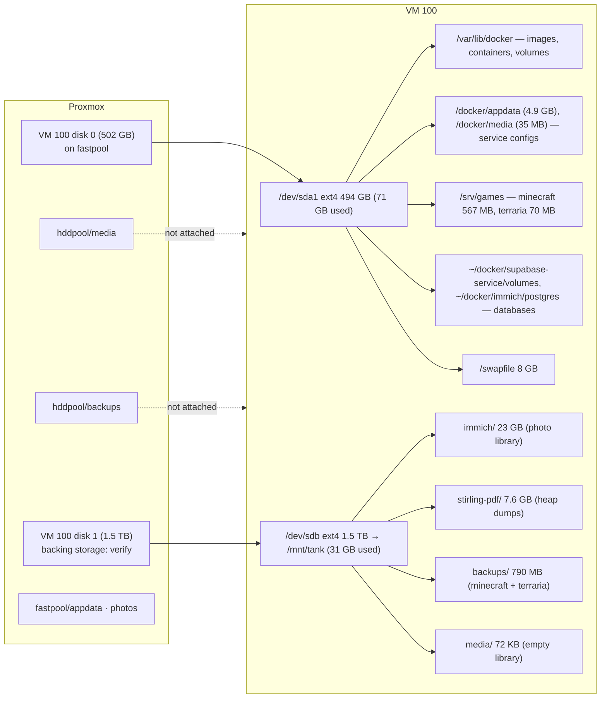

# Container Workloads

> Last verified 2026-09-25 (audit script + targeted checks) on VM 100 `debian-docker`; first inspection 2026-09-16. Docker Engine 29.6.2, Compose 5.3.1, storage driver `overlayfs`, cgroup v2 (systemd), runtimes `runc` (default) + `nvidia`. **40 containers, 38 images (38.1 GB, 0 reclaimable), 9 Compose projects.**

## 1. Stack inventory

| Compose project | Directory | Network | Containers | State |
|---|---|---|---|---|
| `ai-tools` | `~/docker/ai-tools` | `server-net` | ollama, n8n, stirling-pdf | 3 running |
| `gaming` | `~/docker/gaming` | `server-net` (+ `host` for playit) | minecraft, mc-backup, terraria, playit | 4 running |
| `media` | `~/docker/media` | `server-net` | gluetun, qbittorrent, jellyfin, sonarr, radarr, prowlarr, kavita, lazylibrarian | 8 running |
| `management` | `~/docker/management` | `server-net` | vaultwarden, homepage, uptime-kuma, dozzle, prometheus, node_exporter, grafana | 7 running |
| `immich` *(new)* | `~/docker/immich` | `immich_default` | immich_server, immich_machine_learning, immich_postgres, immich_redis | 4 running, healthy |
| `supabase` | `~/docker/supabase-service` (upstream self-host repo + optional overlays) | `supabase_default` | 11 (see §2.5) | 11 running, healthy |
| `reverse-proxy` *(new)* | `~/docker/reverse-proxy` | `reverse-proxy_default` | nginx-proxy | 1 running |
| `portfolio` *(new)* | `~/docker/portfolio` | `portfolio_default` | portfolio-web (+ one-shot `portfolio-build`) | 1 running |
| `mush` | `~/Mush` | `mush_default` | mush-frontend | 1 running |

Leftovers on disk, not deployed: `/docker/appdata/caddy` (state from the retired Caddy proxy), empty `/docker/appdata/{grafana,mush}` and stray `~/docker/appdata/{n8n,ollama}` (36 KB) that no container mounts. The live n8n/Ollama data is under `/docker/appdata`.

Environment files: `~/docker/.env` (shared: domain + Cloudflare API token) and one `.env` per stack (`ai-tools`, `immich`, `management`, `media`, `supabase-service`, `~/Mush`). All are currently mode `644`; see the security doc, finding 7.

## 2. Categorised breakdown

### 2.1 Gaming (`gaming`)

| Container | Image | Ports | Memory cap | Persistent paths | Notes |
|---|---|---|---|---|---|
| minecraft | `itzg/minecraft-server:latest` | 25565, 25575 (RCON) | 5 GiB | `/srv/games/minecraft/data → /data` | `TYPE=PAPER`, `USE_AIKAR_FLAGS`, `INIT_MEMORY=1G`, `MAX_MEMORY=4G`, `ENABLE_RCON`; healthy. **Moved from `/mnt/tank/minecraft` on 2026-09-24.** |
| mc-backup | `itzg/mc-backup:latest` | — | 512 MiB | `/srv/games/minecraft → /data:ro`, `/mnt/tank/backups/minecraft → /backups` | `BACKUP_INTERVAL`, `RETAIN_COUNT`, RCON to minecraft. 9 archives present (daily plus two taken on the 2026-09-24 recreate). Its `/data` is the *parent* of the server's data dir, so archives contain an extra `data/` level. |
| terraria | `brammys/terraria:latest` | 7777 tcp+udp | 2 GiB | `/srv/games/terraria/Worlds → /worlds`, `/srv/games/terraria/configs → /configs` | `TERRARIA_WORLD`, `AUTOCREATE`, `MAXPLAYERS`. The world was last saved 2026-09-14. **The backup cron still targets the old path** (§6). |
| playit | `ghcr.io/playit-cloud/playit-agent:latest` | host netns | none | — | `SECRET_KEY` inline in compose. Duplicates the host `playit.service`. |

### 2.2 Media & books (`media`)

| Container | Image | Ports | Memory cap | Persistent paths | Notes |
|---|---|---|---|---|---|
| gluetun | `qmcgaw/gluetun:latest` | 8080, 6881 tcp+udp (for qbittorrent) | none | — | `NET_ADMIN`, `/dev/net/tun`, Mullvad WireGuard; healthy. Private key inline in compose. |
| qbittorrent | `lscr.io/linuxserver/qbittorrent:latest` | via gluetun | none | `/home/<user>/docker/media/config/qbittorrent → /config`, `/mnt/tank/media/downloads → /downloads` | `network_mode: service:gluetun`, PUID/PGID 1000. **Config path is still inconsistent** with the `/docker/media/config/*` convention. |
| jellyfin | `jellyfin/jellyfin:latest` | 8096, 8920 | none | `/docker/media/config/jellyfin → /config`, `/docker/media/cache/jellyfin → /cache`, `/mnt/tank/media → /media` | nvidia device reservation (NVENC/NVDEC work on driver 535); healthy; library empty. |
| sonarr | `lscr.io/linuxserver/sonarr:latest` | 8989 | none | `/docker/media/config/sonarr`, `/mnt/tank/media → /media` | |
| radarr | `lscr.io/linuxserver/radarr:latest` | 7878 | none | `/docker/media/config/radarr`, `/mnt/tank/media → /media` | |
| prowlarr | `lscr.io/linuxserver/prowlarr:latest` | 9696 | none | `/docker/media/config/prowlarr` | Indexer hub. |
| kavita | `jvmilazz0/kavita:latest` | 5000 | none | `/docker/media/config/kavita → /kavita/config`, `/mnt/tank/media/books → /books` | healthy |
| lazylibrarian | `lscr.io/linuxserver/lazylibrarian:latest` | 5299 | none | `/docker/media/config/lazylibrarian`, `/mnt/tank/media/downloads`, `/mnt/tank/media/books` | `DOCKER_MODS` (calibre). |

### 2.3 AI & automation (`ai-tools`)

| Container | Image | Ports | Memory cap | Persistent paths | Notes |
|---|---|---|---|---|---|
| ollama | `ollama/ollama:latest` | 11434 | **none** | `/docker/appdata/ollama → /root/.ollama` (4.9 GB; model `qwen3:8b`, 5.2 GB) | `OLLAMA_KEEP_ALIVE=0`, `OLLAMA_HOST=0.0.0.0:11434`. GPU reservation present, but the runtime is **CPU** (driver 535 < 550). |
| n8n | `docker.n8n.io/n8nio/n8n:latest` | **`0.0.0.0:5678`** | 1 GiB | `/docker/appdata/n8n → /home/node/.n8n` (9 MB) | `N8N_HOST`, `N8N_PROTOCOL`, `WEBHOOK_URL`; fronted by nginx at `n8n.example.com`. The loopback binding was lost. |
| stirling-pdf | `frooodle/s-pdf:latest` | 8081→8080 | 1 GiB (memswap 2 GiB) | `/mnt/tank/stirling-pdf/extraConfigs → /configs`, `/mnt/tank/stirling-pdf/trainingData → /usr/share/tessdata` (empty, 4 KB) | Healthy, ~370 MiB. `JAVA_CUSTOM_OPTS` still unset. **`/configs/heap_dumps` holds 33 heap dumps (7.6 GB) from 2026-09-12..14** (see §3.2). |

### 2.4 Management & observability (`management`)

| Container | Image | Ports | Memory cap | Persistent paths | Notes |
|---|---|---|---|---|---|
| vaultwarden | `vaultwarden/server:latest` | 8222→80 | none | `/docker/media/config/vaultwarden → /data` | `SIGNUPS_ALLOWED=true`, `DOMAIN` set; no nginx vhost; healthy. |
| homepage | `ghcr.io/gethomepage/homepage:latest` | 3000 | none | `/docker/media/config/homepage → /app/config`, Docker socket **rw** | `HOMEPAGE_ALLOWED_HOSTS`. |
| uptime-kuma | `louislam/uptime-kuma:1` | 3001 | none | `/docker/media/uptime-kuma → /app/data` | healthy |
| dozzle | `amir20/dozzle:latest` | 8888→8080 | none | Docker socket ro | |
| prometheus | `prom/prometheus:latest` | 9090 | none | `~/docker/management/prometheus.yml:ro`, volume `monitoring_prometheus_data` | Single job `debian-vm` → `node-exporter:9100`. A second, unused `prometheus/prometheus.yml` also exists in the stack dir. |
| node_exporter | `prom/node-exporter:latest` | 9100 (internal) | none | `/ → /host:ro` | |
| grafana | `grafana/grafana:latest` | 3005→3000 | none | volume `monitoring_grafana_data` | `depends_on: prometheus` |

### 2.5 Photos (`immich`) *(new since 2026-09-16)*

| Container | Image | Ports | Persistent paths | Notes |
|---|---|---|---|---|
| immich_server | `ghcr.io/immich-app/immich-server:v3` | 2283 | `/mnt/tank/immich → /data` (23 GB library), `/etc/localtime:ro` | `restart: always`; depends on database + redis; ~2–2.4 GiB RSS, CPU-heavy during jobs |
| immich_machine_learning | `ghcr.io/immich-app/immich-machine-learning:v3` | internal | volume `immich_model-cache → /cache` | CPU inference (no GPU reservation); ~1 GiB RSS, 200 % CPU while indexing |
| immich_postgres | `ghcr.io/immich-app/postgres:14-vectorchord0.4.3-pgvectors0.2.0` (digest-pinned) | 5432 internal | `~/docker/immich/postgres → /var/lib/postgresql/data` (root disk, ~310 MB) | **No backup.** Holds all albums, faces, users and asset metadata. |
| immich_redis | `valkey/valkey:9` (digest-pinned) | 6379 internal | — | Queue/cache only |

Immich is published on :2283 and proxied at `immich.example.com`. No memory caps are set. The library is on the data disk and the database on the root disk, so a restore needs both, from the same point in time.

### 2.6 Application platform (`supabase`, `mush`, `portfolio`, `reverse-proxy`)

| Container | Image | Ports | Persistent paths |
|---|---|---|---|
| supabase-db | `supabase/postgres:17.6.1.136` | 5432 (internal) | `volumes/db/data → /var/lib/postgresql/data`, init SQL binds, volume `supabase_db-config` |
| supabase-pooler | `supabase/supavisor:2.9.5` | 5432, 6543 | `volumes/pooler/pooler.exs:ro` |
| supabase-kong | `kong/kong:3.9.1` | 8000, 8443 | `volumes/api/kong.yml:ro`, entrypoint script |
| supabase-auth | `supabase/gotrue:v2.189.0` | internal | — (1 restart since the 2026-09-24 recreate) |
| supabase-rest | `postgrest/postgrest:v14.12` | 3000 internal | — |
| realtime-dev.supabase-realtime | `supabase/realtime:v2.102.3` | internal | — |
| supabase-storage | `supabase/storage-api:v1.60.4` | 5000 internal | `volumes/storage → /var/lib/storage` |
| supabase-imgproxy | `darthsim/imgproxy:v3.30.1` | 8080 internal | `volumes/storage` (shared) |
| supabase-meta | `supabase/postgres-meta:v0.96.6` | 8080 internal | — |
| supabase-edge-functions | `supabase/edge-runtime:v1.74.0` | internal | `volumes/functions`, volume `supabase_deno-cache` |
| supabase-studio | `supabase/studio:latest` | `127.0.0.1:3002`→3000 | `volumes/functions:ro`, `volumes/snippets` |
| mush-frontend | `nginx:alpine` | 8085→80 | `~/Mush/dist:ro`, `~/Mush/nginx.conf:ro` |
| portfolio-web | `nginx:alpine` | 8090→80 | `~/docker/portfolio/repo/dist:ro` (built by the one-shot `portfolio-build`, `node:20-alpine`) |
| nginx-proxy | `nginx:alpine` | 80, 443 | `~/docker/reverse-proxy/conf.d:ro`, `/etc/letsencrypt:ro`; `extra_hosts: host.docker.internal:host-gateway` |

All Supabase paths are relative to `~/docker/supabase-service/` (68 MB). The stack is pinned to explicit versions; Immich is pinned by major version and digest; everything else uses `:latest`.

## 3. Memory allocation rationale

The guest has 11.7 GiB usable RAM and an 8 GiB swapfile. On 2026-09-25 **7.9 GiB of swap was in use**. Hard cgroup caps sum to **9.5 GiB**; Docker's default `memswap` is 2× the cap, so a capped container may also use up to its cap again in swap before the cgroup OOM-killer fires.

### 3.1 Minecraft (Paper): 5 GiB cap, `-Xms1G -Xmx4G`

JVM flags (Aikar's, injected by `USE_AIKAR_FLAGS=true`):

```
-XX:+UseG1GC -XX:+ParallelRefProcEnabled -XX:MaxGCPauseMillis=200
-XX:+UnlockExperimentalVMOptions -XX:+DisableExplicitGC -XX:+AlwaysPreTouch
-XX:G1NewSizePercent=30 -XX:G1MaxNewSizePercent=40 -XX:G1HeapRegionSize=8M
-XX:G1ReservePercent=20 -XX:G1HeapWastePercent=5 -XX:G1MixedGCCountTarget=4
-XX:InitiatingHeapOccupancyPercent=15 -XX:G1MixedGCLiveThresholdPercent=90
-XX:G1RSetUpdatingPauseTimePercent=5 -XX:SurvivorRatio=32
-XX:+PerfDisableSharedMem -XX:MaxTenuringThreshold=1 -Xmx4G -Xms1G
```

- **Why `-Xmx4G` under a 5 GiB cap:** the JVM's resident footprint is the heap **plus** metaspace, code cache, GC card tables, thread stacks and native buffers, typically 15–25 % on top of the heap. 1 GiB of headroom keeps RSS below the cgroup limit, so the kernel never SIGKILLs the server mid-save.
- **Why `-Xms1G`:** `AlwaysPreTouch` commits heap pages at start; a 4 GiB `Xms` would pin 4 GiB of physical RAM in a 12 GiB guest.
- **G1 tuning** targets 200 ms pauses with a 30–40 % young generation; short-lived chunk/entity objects die young.
- **Observed:** ~920 MiB RSS at idle.
- mc-backup issues `save-off`, `save-all`, tar, `save-on` over RCON, so backups are consistent without stopping the JVM.

### 3.2 Stirling-PDF: target 512 MiB / `-Xms64m -Xmx256m`; observed 1 GiB / defaults

| Parameter | Intended | Observed (2026-09-25) |
|---|---|---|
| Docker limit | 512 MiB | **1 GiB** (memswap 2 GiB) |
| JVM heap | `-Xms64m -Xmx256m` | `JAVA_CUSTOM_OPTS` unset. The image default gives max heap = 25 % of the cgroup (~256 MiB), `-XX:+ExitOnOutOfMemoryError`, `-XX:+HeapDumpOnOutOfMemoryError` → `/configs/heap_dumps` |
| State | running | running, healthy, ~370 MiB |

**Corrected diagnosis.** The 2026-09-16 docs treated the 7.6 GB under `/mnt/tank/stirling-pdf` as OCR training data and read the exit-137 restarts as an operator stop. In fact `trainingData` is empty. The 7.6 GB is **33 heap dumps of ~248 MB each**, written 2026-09-12 → 09-14: the ~256 MiB default heap was exhausted repeatedly, and each OOM wrote a dump, exited and restarted. No dumps have appeared since 2026-09-14.

Fix:

- Delete the dumps (reclaims 7.6 GB).
- Set `JAVA_CUSTOM_OPTS=-Xms64m -Xmx512m -XX:-HeapDumpOnOutOfMemoryError`. 256 MiB proved too small for the documents in use, and dumps are only useful when someone will analyse them.
- Keep the 1 GiB cap, which leaves room for LibreOffice/Tesseract sub-processes.
- Add `stop_grace_period: 30s`.

### 3.3 Chrome GUI / Playwright (planned 1.5 GiB cap, `shm_size: 1gb`)

The headless browser stack still runs **natively on the host, uncontained**: Xvfb `:99` → `x11vnc -nopw` on :5900 → websockify/noVNC on :3010 (both bound to the Tailscale IP only since 2026-09-25; start/stop with `/usr/local/bin/vnc-tailscale.sh`, which is **not** run at boot), plus Google Chrome for Playwright MCP. The renderers use ~120–150 MiB each, about 1 GiB in total.

Rationale for the planned container limits: Chrome allocates one renderer per tab/iframe (100–300 MiB each). A 1.5 GiB cap bounds this to about 6–8 live tabs before the cgroup OOM-killer reaps a renderer; the tab crashes but the browser survives. `shm_size: 1gb` is required because Chrome uses `/dev/shm` for compositor/IPC buffers. Containerising also removes the unauthenticated VNC exposure.

### 3.4 Ollama / AI workloads

| Parameter | Intended | Observed |
|---|---|---|
| Docker memory limit | strict RAM cap | **none** |
| Swap cap | 2 GiB | not set; guest swap is full |
| GPU | nvidia runtime, VRAM-balanced | reservation present; log 2026-09-23: `NVIDIA driver too old … driver=535 required_driver="550 or newer"`, `library=cpu` |
| Model | — | `qwen3:8b` (5.2 GB) |
| Idle behaviour | — | `OLLAMA_KEEP_ALIVE=0`: the model is unloaded after each request |

An 8 B Q4 model needs ~5–6 GiB for weights plus KV cache. On the GPU that fits the 2060 SUPER's 8 GiB VRAM; on CPU fallback it is mapped into guest RAM that is already exhausted. Target state once the driver is fixed: `memory: 3G`, `memswap_limit: 5G`, keep the GPU reservation, `OLLAMA_MAX_LOADED_MODELS=1`, `OLLAMA_NUM_PARALLEL=1`. Installing the 550+ driver in the guest (bookworm-backports or the NVIDIA CUDA repo) also lets Immich ML use CUDA.

### 3.5 Immich (new, uncapped)

Immich server (~2–2.4 GiB) and machine-learning (~1 GiB, 200 % CPU while indexing) are now the largest uncapped consumers. Recommended caps: `immich_machine_learning` `mem_limit: 1536m` with `MACHINE_LEARNING_WORKERS=1`, and `immich_server` `mem_limit: 3g`. Schedule heavy jobs (face detection, smart search re-index) off-peak in the Immich admin UI. Longer term, give the ML container the GPU once the driver is upgraded.

### 3.6 Secondary caps

- **n8n 1 GiB:** set `NODE_OPTIONS=--max-old-space-size=768` so Node GCs before the cgroup kills it.
- **Terraria 2 GiB:** generous; mainly a leak guard.
- **Uncapped set** (media, management, Supabase, Ollama, Immich): ~5 GiB RSS combined on 2026-09-25. Capping Immich ML, Jellyfin, Kong and Grafana at 512 MiB–1.5 GiB would bound the tail.
- **Bottom line:** with Immich added, the workload no longer fits in 12 GB. Raise VM 100 to 16–20 GB if the host has headroom.

## 4. Runtime and daemon configuration

- `/etc/docker/daemon.json` registers only the `nvidia` runtime. **Logging is still default `json-file` with no rotation**: every container reports `max-size: none`. Add `"log-driver":"json-file","log-opts":{"max-size":"10m","max-file":"3"}` and recreate containers (existing containers keep their old log config).
- `nvidia-container-toolkit 1.20.0-1`, NVIDIA driver 535.309.01 (Debian packaged), `nvidia-persistenced` active.
- Images: 38, 38.1 GB, 0 reclaimable (pruned since 2026-09-16). Named volumes: `immich_model-cache`, `monitoring_grafana_data`, `monitoring_prometheus_data`, `supabase_db-config`, `supabase_deno-cache` (1.05 GB total).

## 5. Storage model

### 5.1 Hypervisor ↔ guest mapping



Facts from `lsblk`, `findmnt` and `/etc/fstab`:

- The guest now has two block devices: `/dev/sda` (502 GB, one ext4 partition, root) and `/dev/sdb` (1.5 TB, ext4 directly on the disk, mounted `defaults,discard` at `/mnt/tank`). There are still **no** ZFS, NFS, CIFS or virtiofs mounts; `rpcbind` runs idle.
- Per-container placement (from the audit's data-location map): **Immich's library is on `/dev/sdb` but its Postgres is on `/dev/sda`**. Supabase (DB, storage, config volume), both game servers, all `/docker` app configs and every named volume are on `/dev/sda`. Only the Immich library, Stirling configs, the media tree and the backups are on `/dev/sdb`. `/mnt/media` and `/mnt/photos` are still empty directories on the root disk.
- Which Proxmox storage backs `/dev/sdb` is not visible from the guest. A 1.5 TB disk does not map neatly onto either pool as described (fastpool 8.72 TB, hddpool 2.72 TB). Run `qm config 100` and `zfs list -t volume` on the host and record the answer here.
- The first inspection's "88 % full" root disk risk is resolved (the disk grew from 102 to 502 GB).
- The game servers moved **off** `/mnt/tank` onto the root disk (`/srv/games`) on 2026-09-24, while their backups stay on `/mnt/tank/backups`. Data and backups now at least sit on different virtual disks.

### 5.2 Persistent path map

| Host path | Size | Used by (container → mount) | Data class |
|---|---|---|---|
| `/srv/games/minecraft` | 567 MB | minecraft `/data` (via `data/`), mc-backup `/data:ro` | World + plugins (owned by UID 1000) |
| `/srv/games/terraria/{Worlds,configs}` | 70 MB | terraria `/worlds`, `/configs` | World |
| `/mnt/tank/backups/minecraft` | ~600 MB | mc-backup `/backups` | 9 world tarballs |
| `/mnt/tank/backups/terraria` | ~190 MB | root cron | 7 daily tarballs up to 2026-09-24; **no new archives after that** |
| `/mnt/tank/immich` | 23 GB | immich_server `/data` | **Photo library: irreplaceable** |
| `~/docker/immich/postgres` | ~310 MB | immich_postgres | **Immich DB: irreplaceable metadata** |
| `/mnt/tank/stirling-pdf/extraConfigs` | 7.6 GB | stirling-pdf `/configs` | Settings + 33 disposable heap dumps |
| `/mnt/tank/media/{downloads,books,…}` | 72 KB | qbittorrent, sonarr, radarr, jellyfin, kavita, lazylibrarian | Media library: empty |
| `/docker/appdata/ollama` | 4.9 GB | ollama `/root/.ollama` | Models (re-downloadable) |
| `/docker/appdata/n8n` | 9 MB | n8n `/home/node/.n8n` | Workflows, credentials DB (encrypted with the n8n key) |
| `/docker/media/config/{jellyfin,sonarr,radarr,prowlarr,kavita,lazylibrarian,vaultwarden,homepage}` | ~35 MB | respective `/config` | App databases and API keys |
| `/docker/media/cache/jellyfin` | ↑ | jellyfin `/cache` | Transcode cache (disposable) |
| `/docker/media/uptime-kuma` | ↑ | uptime-kuma `/app/data` | Monitor DB |
| `/home/<user>/docker/media/config/qbittorrent` | small | qbittorrent `/config` | Non-standard location |
| `~/docker/supabase-service/volumes/db/data` | part of 68 MB | supabase-db | **Postgres cluster: high-value state** |
| `~/docker/supabase-service/volumes/{storage,functions,snippets,api,pooler}` | ↑ | storage, imgproxy, edge-functions, studio, kong, pooler | Objects, functions, config |
| `~/docker/reverse-proxy/conf.d`, `/etc/letsencrypt` | 40 KB + certs | nginx-proxy (ro) | Proxy config + TLS |
| `~/Mush/{dist,nginx.conf}`, `~/docker/portfolio/repo/dist` | 165 MB (portfolio repo) | mush-frontend, portfolio-web | Build output (regenerable from source) |
| `~/docker/management/prometheus.yml` | — | prometheus | Scrape config |
| Named volumes (5) | 1.05 GB | immich ML, prometheus, grafana, supabase-db, edge-functions | Model cache, TSDB, dashboards, PG config, deno cache |
| `/var/run/docker.sock` | — | dozzle (ro), homepage (**rw**) | Control plane |
| `/` (ro) | — | node_exporter `/host` | Metrics |

### 5.3 Recommended dataset alignment

| Guest path | Move to | Mechanism | Why |
|---|---|---|---|
| `/mnt/tank/media` | `hddpool/media` | NFS export from PVE (or a virtio disk on `hddpool`) at `/mnt/media`; re-point compose binds | Bulk media belongs on the HDD pool |
| `/mnt/tank/backups` | `hddpool/backups` | Same, mounted at `/mnt/backups` | Backups must not share a VM, and ideally not a pool, with the data they protect |
| `/mnt/tank/immich` | `fastpool/photos` | NFS export or dedicated virtio disk | The dataset was provisioned for this; enables per-dataset ZFS snapshots of the library |
| `/docker`, `/srv/games`, Supabase + Immich DB dirs | `fastpool/appdata` | Dedicated virtio disk mounted at `/docker` (move `/srv/games` under it) | Separates app state from the OS for snapshots and restores |

## 6. Drift register (design vs. observed)

| Item | Design | Observed 2026-09-16 | Observed 2026-09-25 | Owner action |
|---|---|---|---|---|
| Stirling-PDF memory | 512 MiB, `-Xms64m -Xmx256m` | 1 GiB, defaults, stopped | 1 GiB, defaults, **running**; 33 heap dumps (7.6 GB) prove repeated heap OOMs | Delete dumps; set `JAVA_CUSTOM_OPTS` (§3.2) |
| Ollama limits | strict RAM/VRAM caps | no cap, CPU | unchanged | Driver ≥ 550; add `memory`/`memswap_limit` |
| Chrome GUI | container, 1.5 GiB, shm 1 GiB | native, VNC no auth | unchanged | Containerise |
| Media library on ZFS | hddpool/media | empty dir on root zvol | empty dir on the 1.5 TB data disk | Export + mount |
| Backups off-box | hddpool/backups + PBS | local dir, same disk | local dir on the data disk; no VM backup job | Disaster-recovery runbook §5 |
| Terraria backup | nightly, 7 kept | working | **broken since the 2026-09-24 move**: cron archives the missing `/mnt/tank/terraria` | Change the cron's `-C` to `/srv/games/terraria` |
| Playit | one agent | two agents | two agents | `systemctl disable --now playit` |
| qBittorrent config path | `/docker/media/config/qbittorrent` | under `/home/<user>` | unchanged | Migrate and update compose |
| n8n binding | loopback, nginx-fronted | `127.0.0.1:5678` | **`0.0.0.0:5678`** | Restore loopback binding |
| Reverse proxy | host nginx | host nginx 1.22 | **`nginx-proxy` container**; host nginx disabled | Docs updated; purge host nginx |
| Public ingress | nginx only | nginx only | nginx **+ Cloudflare Tunnel** | Pick one path; document tunnel hostnames |
| Photos (Phase 2.2) | Immich on `fastpool/photos` | absent | deployed; library on `/mnt/tank`, DB on root disk, no backup | Back up DB + library; consider `fastpool/photos` |
| Root disk | — | 102 GB, 88 % | 502 GB, 15 % | Resolved |
| Docker log rotation | bounded | none | none | `daemon.json` log opts |
| Phase 2.6 monitoring | unchecked | running, 1 job | unchanged | Add cAdvisor + alert rules |
| Guest RAM | 12 GB | 5.7 GiB swap used | **7.9 GiB swap used** (full) | Raise VM memory; cap Immich |
