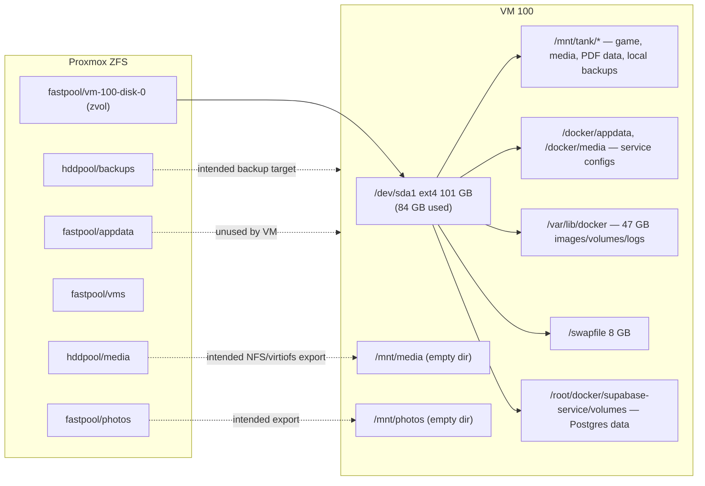

# Container Workloads

> Live inspection of VM 100 `debian-docker`, 2026-09-16. Docker Engine 29.6.2, Compose 5.3.1, storage driver `overlayfs`, cgroup v2 (systemd), runtimes `runc` + `nvidia`. 34 containers, 44 images, 6 Compose projects.

## 1. Stack inventory

| Compose project | Directory | Network | Containers | State |
|---|---|---|---|---|
| `ai-tools` | `~/docker/ai-tools` | `server-net` | ollama, n8n, stirling-pdf | 2 running, stirling-pdf exited |
| `gaming` | `~/docker/gaming` | `server-net` (+ `host` for playit) | minecraft, mc-backup, terraria, playit | 4 running |
| `media` | `~/docker/media` | `server-net` | gluetun, qbittorrent, jellyfin, sonarr, radarr, prowlarr, kavita, lazylibrarian | 8 running |
| `management` | `~/docker/management` | `server-net` | vaultwarden, homepage, uptime-kuma, dozzle, prometheus, node_exporter, grafana | 7 running |
| `supabase` | `~/docker/supabase-service` (upstream self-host repo, `docker-compose.yml` + optional overlays) | `supabase_default` | 11 (see §2.5) | 11 running |
| `mush` | `~/Mush` | `mush_default` | mush-frontend | 1 running |

Not deployed but present on disk: `~/CSStuff/career-ops/docker-compose.yml` (image `career-ops:local`, no ports); `~/docker/appdata/caddy` (state from a retired Caddy reverse proxy; nginx replaced it).

Shared `.env` keys: `~/docker/.env` → `MY_DOMAIN`, `CLOUDFLARE_API_TOKEN`; each stack has its own `.env` with `MY_DOMAIN` used for `N8N_HOST`, `WEBHOOK_URL`, Vaultwarden `DOMAIN`, `JELLYFIN_PublishedServerUrl`.

## 2. Categorised breakdown

### 2.1 Gaming (`gaming`)

| Container | Image | Ports | Memory cap | Persistent paths | Notes |
|---|---|---|---|---|---|
| minecraft | `itzg/minecraft-server:latest` | 25565, 25575 (RCON) | 5 GiB (swap ceiling 10 GiB) | `/mnt/tank/minecraft → /data` | `TYPE=PAPER`, `USE_AIKAR_FLAGS=true`, `INIT_MEMORY=1G`, `MAX_MEMORY=4G`, `ENABLE_RCON=true`, healthy |
| mc-backup | `itzg/mc-backup:latest` | — | 512 MiB | `/mnt/tank/minecraft → /data:ro`, `/mnt/tank/backups/minecraft → /backups` | `BACKUP_INTERVAL=24h`, `RETAIN_COUNT=7`, RCON to `minecraft:25575`; 7 archives present (daily ~08:25) |
| terraria | `brammys/terraria:latest` | 7777 tcp+udp | 2 GiB | `/mnt/tank/terraria/Worlds → /worlds`, `/mnt/tank/terraria/configs → /configs` | `TERRARIA_WORLD=world1`, `AUTOCREATE=3` (large), `MAXPLAYERS=10`, `tty`+`stdin_open` for console |
| playit | `ghcr.io/playit-cloud/playit-agent:latest` | host netns | none | — | `SECRET_KEY=<YOUR_SECRET>`; duplicates host `playit.service` |

### 2.2 Media & books (`media`)

| Container | Image | Ports | Memory cap | Persistent paths | Notes |
|---|---|---|---|---|---|
| gluetun | `qmcgaw/gluetun:latest` | 8080, 6881 tcp+udp (on behalf of qbittorrent) | none | — (state in container) | `NET_ADMIN`, `/dev/net/tun`, Mullvad WireGuard USA, healthy |
| qbittorrent | `lscr.io/linuxserver/qbittorrent:latest` | via gluetun | none | `/home/christopherle/docker/media/config/qbittorrent → /config`, `/mnt/tank/media/downloads → /downloads` | `network_mode: service:gluetun`, PUID/PGID 1000, `WEBUI_PORT=8080`. **Config path is inconsistent** with the `/docker/media/config/*` convention used by every other service. |
| jellyfin | `jellyfin/jellyfin:latest` | 8096, 8920 | none | `/docker/media/config/jellyfin → /config`, `/docker/media/cache/jellyfin → /cache`, `/mnt/tank/media → /media` | nvidia device reservation (NVENC/NVDEC via driver 535 works for Jellyfin), healthy, library empty |
| sonarr | `lscr.io/linuxserver/sonarr:latest` | 8989 | none | `/docker/media/config/sonarr`, `/mnt/tank/media → /media` | |
| radarr | `lscr.io/linuxserver/radarr:latest` | 7878 | none | `/docker/media/config/radarr`, `/mnt/tank/media → /media` | |
| prowlarr | `lscr.io/linuxserver/prowlarr:latest` | 9696 | none | `/docker/media/config/prowlarr` | Indexer hub for sonarr/radarr/lazylibrarian |
| kavita | `jvmilazz0/kavita:latest` | 5000 | none | `/docker/media/config/kavita → /kavita/config`, `/mnt/tank/media/books → /books` | healthy |
| lazylibrarian | `lscr.io/linuxserver/lazylibrarian:latest` | 5299 | none | `/docker/media/config/lazylibrarian`, `/mnt/tank/media/downloads`, `/mnt/tank/media/books` | `DOCKER_MODS=linuxserver/mods:universal-calibre` |

### 2.3 AI & automation (`ai-tools`)

| Container | Image | Ports | Memory cap | Persistent paths | Notes |
|---|---|---|---|---|---|
| ollama | `ollama/ollama:latest` | 11434 | **none** | `/docker/appdata/ollama → /root/.ollama` (4.9 GB, model `qwen3:8b` 5.2 GB) | `OLLAMA_KEEP_ALIVE=0`; nvidia device reservation present but **runtime is CPU** (driver 535 < 550 required) |
| n8n | `docker.n8n.io/n8nio/n8n:latest` | `127.0.0.1:5678` | 1 GiB | `/docker/appdata/n8n → /home/node/.n8n` | `N8N_PROTOCOL=https`, `WEBHOOK_URL=https://n8n.example.com/`, fronted by nginx |
| stirling-pdf | `frooodle/s-pdf:latest` (v2.14.3, Java 25) | 8081→8080 | 1 GiB | `/mnt/tank/stirling-pdf/trainingData → /usr/share/tessdata` (7.6 GB OCR data), `/mnt/tank/stirling-pdf/extraConfigs → /configs` | `DOCKER_ENABLE_SECURITY=false`, `INSTALL_BOOK_AND_ADVANCED_HTML_OPS=true`, `JAVA_CUSTOM_OPTS` empty; **exited 137** on 2026-09-14 after three rapid restarts, `OOMKilled=false` |

### 2.4 Management & observability (`management`)

| Container | Image | Ports | Memory cap | Persistent paths | Notes |
|---|---|---|---|---|---|
| vaultwarden | `vaultwarden/server:latest` | 8222→80 | none | `/docker/media/config/vaultwarden → /data` | `SIGNUPS_ALLOWED=true`, `DOMAIN=https://vaultwarden.example.com` (no nginx vhost exists for it yet), healthy |
| homepage | `ghcr.io/gethomepage/homepage:latest` | 3000 | none | `/docker/media/config/homepage → /app/config`, Docker socket **rw** | `HOMEPAGE_ALLOWED_HOSTS=*`; config dir holds only `settings.yaml` + `kubernetes.yaml` |
| uptime-kuma | `louislam/uptime-kuma:1` | 3001 | none | `/docker/media/uptime-kuma → /app/data` | healthy |
| dozzle | `amir20/dozzle:latest` | 8888→8080 | none | Docker socket ro | |
| prometheus | `prom/prometheus:latest` | 9090 | none | `./prometheus.yml:ro`, volume `monitoring_prometheus_data` | 15 s scrape, single job `debian-vm` → `node-exporter:9100` |
| node_exporter | `prom/node-exporter:latest` | 9100 (internal) | none | `/ → /host:ro,rslave` | `pid: host`, `--path.rootfs=/host` |
| grafana | `grafana/grafana:latest` | 3005→3000 | none | volume `monitoring_grafana_data` | `depends_on: prometheus` |

### 2.5 Application platform (`supabase`, `mush`)

| Container | Image | Ports | Persistent paths |
|---|---|---|---|
| supabase-db | `supabase/postgres:17.6.1.136` | 5432 (internal) | `volumes/db/data → /var/lib/postgresql/data`, init SQL binds, volume `supabase_db-config` |
| supabase-pooler | `supabase/supavisor:2.9.5` | 5432, 6543 | `volumes/pooler/pooler.exs:ro` |
| supabase-kong | `kong/kong:3.9.1` | 8000, 8443 | `volumes/api/kong.yml:ro`, entrypoint script |
| supabase-auth | `supabase/gotrue:v2.189.0` | internal | — |
| supabase-rest | `postgrest/postgrest:v14.12` | 3000 internal | — |
| realtime-dev.supabase-realtime | `supabase/realtime:v2.102.3` | internal | — |
| supabase-storage | `supabase/storage-api:v1.60.4` | 5000 internal | `volumes/storage → /var/lib/storage` |
| supabase-imgproxy | `darthsim/imgproxy:v3.30.1` | 8080 internal | `volumes/storage` (shared) |
| supabase-meta | `supabase/postgres-meta:v0.96.6` | 8080 internal | — |
| supabase-edge-functions | `supabase/edge-runtime:v1.74.0` | internal | `volumes/functions`, volume `supabase_deno-cache` |
| supabase-studio | `supabase/studio:latest` | `127.0.0.1:3002`→3000 | `volumes/functions:ro`, `volumes/snippets` |
| mush-frontend | `nginx:alpine` | 8085→80 | `~/Mush/dist:ro`, `~/Mush/nginx.conf:ro` |

All Supabase paths are relative to `~/docker/supabase-service/` (67 MB total). No memory limits are set in the Supabase compose. The stack is pinned to explicit versions (good for reproducibility); everything else in the lab uses `:latest`.

## 3. Memory allocation rationale

The guest has 11.7 GiB usable RAM and an 8 GiB swapfile (`vm.swappiness=60`, `vm.overcommit_memory=0`). Hard cgroup caps sum to **9.5 GiB**; Docker's default `memswap` is 2× the cap, so a capped container may also use up to its cap again in swap before the cgroup OOM-killer fires.

### 3.1 Minecraft (Paper) — 5 GiB cap, `-Xms1G -Xmx4G`

Observed JVM command line (Aikar's flags, injected by `USE_AIKAR_FLAGS=true`):

```
-XX:+UseG1GC -XX:+ParallelRefProcEnabled -XX:MaxGCPauseMillis=200
-XX:+UnlockExperimentalVMOptions -XX:+DisableExplicitGC -XX:+AlwaysPreTouch
-XX:G1NewSizePercent=30 -XX:G1MaxNewSizePercent=40 -XX:G1HeapRegionSize=8M
-XX:G1ReservePercent=20 -XX:G1HeapWastePercent=5 -XX:G1MixedGCCountTarget=4
-XX:InitiatingHeapOccupancyPercent=15 -XX:G1MixedGCLiveThresholdPercent=90
-XX:G1RSetUpdatingPauseTimePercent=5 -XX:SurvivorRatio=32
-XX:+PerfDisableSharedMem -XX:MaxTenuringThreshold=1 -Xmx4G -Xms1G
```

- **Why `-Xmx4G` under a 5 GiB cap:** the JVM's resident footprint is heap **plus** metaspace, code cache, GC card tables, thread stacks and native (Netty direct) buffers, typically 15–25 % on top of the heap. 1 GiB of headroom keeps the container's RSS below the cgroup limit so the kernel never SIGKILLs the server mid-save (which would corrupt region files).
- **Why `-Xms1G` rather than `-Xms4G`:** `AlwaysPreTouch` commits heap pages at start, so a 4 GiB `Xms` would immediately pin 4 GiB of physical RAM in a 12 GiB guest. Starting at 1 GiB lets G1 grow only under real load and leaves memory for Ollama/Supabase.
- **G1 tuning** targets 200 ms pause with a 30–40 % young generation: short-lived chunk/entity objects die young, so a large nursery reduces promotion and full-GC risk. `MaxTenuringThreshold=1` accelerates this.
- **Observed:** ~870 MiB RSS at idle with no players, consistent with `Xms1G` minus uncommitted regions.
- mc-backup issues `save-off`, `save-all`, tar, `save-on` over RCON, so backups are crash-consistent without stopping the JVM; its own 512 MiB cap prevents a large world tar from competing with the server.

### 3.2 Stirling-PDF — target 512 MiB / `-Xms64m -Xmx256m`; observed 1 GiB / defaults

The design intent is a small-footprint Spring Boot service: a 256 MiB heap is enough for typical page operations, and 512 MiB leaves room for LibreOffice/unoserver and Tesseract sub-processes.

What is actually deployed:

| Parameter | Intended | Observed |
|---|---|---|
| Docker limit | 512 MiB | **1 GiB** (`memswap` 2 GiB) |
| JVM heap | `-Xms64m -Xmx256m` | `JAVA_CUSTOM_OPTS=` empty → image default (`_JVM_OPTS_BALANCED`: G1, `-XX:+ExitOnOutOfMemoryError`, `-XX:+HeapDumpOnOutOfMemoryError` to `/configs/heap_dumps`, `+UseCompactObjectHeaders`, virtual threads) with the JVM's default max heap = 25 % of the cgroup limit (~256 MiB) |
| State | running | **exited 137**, `OOMKilled=false` |

Interpretation: exit 137 with `OOMKilled=false` and no kernel OOM message means the process received SIGKILL from outside the cgroup OOM path, which is what `docker stop` does after its 10 s grace period when the JVM plus unoserver do not exit on SIGTERM. The three restarts within one minute on 2026-09-14 03:39–03:40 suggest an operator restart loop, followed by a manual stop. Recommended: apply the intended flags explicitly via `JAVA_CUSTOM_OPTS=-Xms64m -Xmx256m`, set `memory: 512M`, set `stop_grace_period: 30s`, and check `/mnt/tank/stirling-pdf/extraConfigs/heap_dumps` for dumps before restarting. Note the image runs Java 25 whose default `ExitOnOutOfMemoryError` will make heap exhaustion show up as a clean exit + restart rather than a hang.

### 3.3 Chrome GUI / Playwright (planned 1.5 GiB cap, `shm_size: 1gb`)

Currently the headless browser stack runs **natively on the host, uncontained**:

| Process | Command (observed) | RSS |
|---|---|---|
| Xvfb | `Xvfb :99 -screen 0 2200x1300x24` | small |
| x11vnc | `x11vnc -display :99 -forever -shared -rfbport 5900 -nopw` | small |
| websockify | `websockify --web=/usr/share/novnc/ 3010 localhost:5900` | small |
| Google Chrome 153 (Playwright MCP profile) | `--disable-dev-shm-usage`, `--no-sandbox` GPU process, 8+ renderers | ~120–150 MiB **per renderer**, ~1 GiB aggregate |

Rationale for the planned container limits: Chrome allocates one renderer per tab/iframe, each 100–300 MiB, so 1.5 GiB bounds the number of live tabs to roughly 6–8 before the cgroup OOM-killer reaps a renderer (Chrome survives renderer loss; the tab crashes, the browser does not). `shm_size: 1gb` is required because Chrome uses `/dev/shm` for compositor and IPC buffers; Docker's default 64 MiB shm causes renderer crashes on large pages, which is why the current native launch passes `--disable-dev-shm-usage`. Moving to a container also removes the unauthenticated VNC exposure noted in the security doc.

### 3.4 Ollama / AI workloads

| Parameter | Intended | Observed |
|---|---|---|
| Docker memory limit | strict RAM cap | **none** (`mem=0`) |
| Swap cap | 2 GiB | not set at container level; guest has 8 GiB swapfile |
| GPU | nvidia runtime, VRAM-balanced | device reservation present, but Ollama logs `NVIDIA driver too old … driver=535 required_driver="550 or newer"` and selects `library=cpu` |
| Model | — | `qwen3:8b` (5.2 GB on disk) |
| Idle behaviour | — | `OLLAMA_KEEP_ALIVE=0` → model unloaded immediately after each request |

Why the intended design matters: an 8 B model at Q4 needs ~5–6 GiB for weights plus KV cache. On GPU that lives in the 8 GiB VRAM of the 2060 SUPER and RAM usage stays under 1 GiB. On CPU fallback the full model is mapped into guest RAM, which with Minecraft at 4 GiB heap and Supabase at 1 GiB is enough to push the guest into swap (the 5.7 GiB swap usage observed is consistent with this). `OLLAMA_KEEP_ALIVE=0` is the current mitigation: the model is resident only during a request.

Recommended target state once the driver is fixed: `memory: 3G`, `memswap_limit: 5G` (i.e. 2 GiB of swap allowance), keep `count: all` GPU reservation, and optionally `OLLAMA_MAX_LOADED_MODELS=1`, `OLLAMA_NUM_PARALLEL=1`. Fixing the driver means installing the NVIDIA 550+ series in the guest (bookworm-backports or the NVIDIA CUDA repo) and rebooting; the Proxmox host does not need a driver because the card is passed through.

### 3.5 Secondary caps

- **n8n 1 GiB:** Node.js default old-space is ~2 GiB on 64-bit, so without a cap a runaway workflow could take 2 GiB+. The 1 GiB cap keeps automation from starving the JVMs; set `NODE_OPTIONS=--max-old-space-size=768` so Node GCs before the cgroup kills it.
- **Terraria 2 GiB:** TShock/vanilla server is ~200–600 MiB even with a large world; 2 GiB is a generous ceiling that mainly guards against leaks.
- **Uncapped set** (media, management, Supabase, Ollama): combined RSS today ~3.2 GiB. The risk is not any one container but Postgres shared buffers + Kong + Jellyfin transcoding coinciding with a Minecraft peak. A 512 MiB–1 GiB cap on Jellyfin, Kong and Grafana would bound the tail without affecting normal operation.

## 4. Runtime and daemon configuration

- `/etc/docker/daemon.json` registers only the `nvidia` runtime (`nvidia-container-runtime`); logging is default `json-file` with **no size rotation** configured. Add `"log-driver":"json-file","log-opts":{"max-size":"10m","max-file":"3"}` to prevent log growth on the 88 %-full root disk.
- `nvidia-container-toolkit 1.20.0`, `nvidia-driver 535.309.01` (Debian packaged), CDI refresh service enabled.
- Images: 44 total, 43.26 GB, 9.49 GB reclaimable; build cache 2.25 GB (2.16 GB reclaimable). `docker system prune` (without `-a`) is safe to run now.

## 5. Storage model

### 5.1 Hypervisor ↔ guest mapping



Facts established by `findmnt`, `lsblk`, `/etc/fstab`:

- The guest has exactly one block device, `/dev/sda` (102 GB, virtio SCSI on Proxmox), one partition, ext4, plus a `/swapfile` entry. There are **no** ZFS, NFS, CIFS, 9p or virtiofs mounts; `nfs-common` and `rpcbind` are installed but idle.
- Therefore every bind mount below resolves to the zvol `fastpool/vm-100-disk-0`, which is on the NVMe pool (fast, but capacity-limited to 102 GB inside the guest and currently 88 % full).
- `/mnt/media` and `/mnt/photos` exist as empty mount points, created 2026-08-28, evidently prepared for `hddpool/media` and `fastpool/photos` exports that were never attached. `/media/downloads` (1.7 GB) on the root FS is a leftover from an earlier download path.

### 5.2 Persistent path map

| Host path | Bytes | Used by (container → mount) | Data class |
|---|---|---|---|
| `/mnt/tank/minecraft` | 332 MB | minecraft `/data`, mc-backup `/data:ro` | World + plugins (owned by `chris`) |
| `/mnt/tank/backups/minecraft` | ~456 MB (both) | mc-backup `/backups` | 7 daily world tarballs |
| `/mnt/tank/backups/terraria` | ↑ | root cron | 8 daily tarballs |
| `/mnt/tank/terraria/{Worlds,configs}` | 70 MB | terraria `/worlds`, `/configs` | World (mode 777) |
| `/mnt/tank/stirling-pdf/{trainingData,extraConfigs}` | 7.6 GB | stirling-pdf `/usr/share/tessdata`, `/configs` | Tesseract models (re-downloadable), settings, heap dumps |
| `/mnt/tank/media/{downloads,books,…}` | 16 KB | qbittorrent, sonarr, radarr, jellyfin, kavita, lazylibrarian | Media library — **empty** |
| `/docker/appdata/ollama` | 4.9 GB | ollama `/root/.ollama` | Models (re-downloadable) |
| `/docker/appdata/n8n` | 8.9 MB | n8n `/home/node/.n8n` | Workflows, credentials DB (SQLite, encrypted with n8n key) |
| `/docker/media/config/{jellyfin,sonarr,radarr,prowlarr,kavita,lazylibrarian,vaultwarden,homepage}` | 34 MB | respective `/config` | App databases and API keys |
| `/docker/media/cache/jellyfin` | ↑ | jellyfin `/cache` | Transcode cache (disposable) |
| `/docker/media/uptime-kuma` | ↑ | uptime-kuma `/app/data` | Monitor DB |
| `/home/christopherle/docker/media/config/qbittorrent` | small | qbittorrent `/config` | Non-standard location |
| `/root/docker/supabase-service/volumes/db/data` | 67 MB (all volumes) | supabase-db `/var/lib/postgresql/data` | **Postgres cluster — highest-value state** |
| `/root/docker/supabase-service/volumes/{storage,functions,snippets,api,pooler}` | ↑ | storage, imgproxy, edge-functions, studio, kong, pooler | Objects, functions, config |
| `/root/Mush/{dist,nginx.conf}` | 164 MB (repo) | mush-frontend | Build output (regenerable from source) |
| `/root/docker/management/prometheus.yml` | — | prometheus | Scrape config |
| Named volumes `monitoring_prometheus_data`, `monitoring_grafana_data`, `supabase_db-config`, `supabase_deno-cache` | 270 MB (all volumes) | prometheus, grafana, supabase-db, edge-functions | TSDB, dashboards, PG custom config, deno cache |
| `/var/run/docker.sock` | — | dozzle (ro), homepage (rw) | Control plane |
| `/` (ro, rslave) | — | node_exporter `/host` | Metrics |

### 5.3 Recommended dataset alignment

To make the ZFS pools do the job they were sized for:

| Guest path | Move to | Mechanism | Why |
|---|---|---|---|
| `/mnt/tank/media` | `hddpool/media` | NFS export from PVE (or a second virtio disk backed by `hddpool`) mounted at `/mnt/media`, then re-point compose binds | Bulk media belongs on the 2.72 TB HDD pool, not the 102 GB zvol |
| `/mnt/tank/backups` | `hddpool/backups` | Same export, or `rsync`/`zfs send` from PVE | Backups must not share a device with the data they protect |
| `/docker/appdata`, `/docker/media`, `/mnt/tank/{minecraft,terraria,stirling-pdf}`, Supabase `volumes/` | `fastpool/appdata` | Second virtio disk on `fastpool/appdata` mounted at `/docker`, ext4 or xfs | Keeps hot state on NVMe with its own dataset for ZFS snapshots independent of the OS disk |
| `/mnt/photos` | `fastpool/photos` | NFS export | Prerequisite for Immich (Phase 2.2) |

Until this is done, `zfs snapshot fastpool/vm-100-disk-0@…` on the hypervisor is the only ZFS-level protection and it snapshots the OS, swap and data together.

## 6. Drift register (design vs. observed)

| Item | Design | Observed | Owner action |
|---|---|---|---|
| Stirling-PDF cap | 512 MiB, `-Xms64m -Xmx256m` | 1 GiB, default JVM opts, stopped | Apply `JAVA_CUSTOM_OPTS`, lower limit, restart |
| Ollama limits | strict RAM/VRAM caps, 2 GiB swap | no cap, CPU inference | Upgrade NVIDIA driver ≥ 550, add `memory`/`memswap_limit` |
| Chrome GUI | container, 1.5 GiB, shm 1 GiB | native processes, no cap, VNC without auth | Containerise (Phase 3.4-adjacent) |
| Media library on ZFS | hddpool/media | empty dir on root zvol | Export + mount |
| Backups off-box | hddpool/backups + PBS | local dir on root zvol | See disaster-recovery runbook |
| Playit | one agent | two agents | Remove one |
| qBittorrent config path | `/docker/media/config/qbittorrent` | `/home/christopherle/docker/media/config/qbittorrent` | Migrate and update compose |
| Phase 2.6 monitoring | unchecked | Prometheus/Grafana/node-exporter running | Update checklist, add cAdvisor + alert rules |
