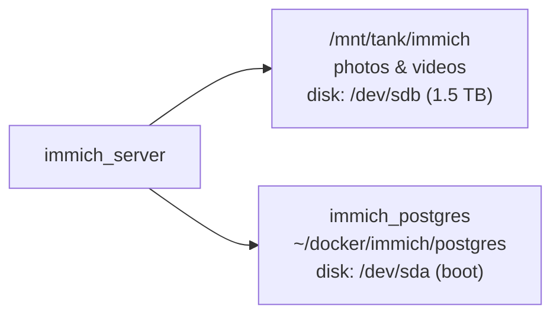

# Immich (`immich`): photo library

> Compose project `~/docker/immich` · network `immich_default` · deployed after 2026-09-16 · last verified 2026-09-25.
> **In one line:** a self-hosted Google Photos. **Irreplaceable data with no backup yet**, so this is the top backup priority.

## Containers

| Container | Image | Ports | Data lives in | Notes |
|---|---|---|---|---|
| immich_server | `ghcr.io/immich-app/immich-server:v3` | 2283 | `/mnt/tank/immich → /data` (**23 GB library, on the 1.5 TB data disk**) | ~2–2.4 GiB RAM, CPU-heavy during jobs; `restart: always` |
| immich_machine_learning | `ghcr.io/immich-app/immich-machine-learning:v3` | internal | named volume `immich_model-cache` | Face/search models on **CPU** (no GPU); ~1 GiB RAM, 200 % CPU while indexing |
| immich_postgres | `ghcr.io/immich-app/postgres:14-vectorchord…` (digest-pinned) | internal 5432 | `~/docker/immich/postgres` (**~310 MB, on the boot disk**) | Albums, faces, users, metadata |
| immich_redis | `valkey/valkey:9` (digest-pinned) | internal 6379 | — | Job queue only |

- **Who can reach it:** `https://immich.example.com` for tailnet devices (DNS points at the Tailscale IP), plus port 2283 on the LAN. Not the internet.
- **Login:** password login, set up (initialized).

## Where the data is, and why it matters



The photos and the database are on **different virtual disks**. A usable backup needs both, captured at the same time: photos without the database lose albums, faces and people; the database without photos is useless.

## Backup (not set up yet)

What to back up nightly:

```bash
# 1. Database dump (safe while running)
docker exec immich_postgres pg_dumpall -U postgres | gzip > /mnt/backups/immich/immich-db-$(date +%F).sql.gz
# 2. Originals (the part that can't be regenerated)
rsync -a --delete /mnt/tank/immich/library/ /mnt/tank/immich/upload/ /mnt/backups/immich/files/
```

Thumbnails and encoded videos can be regenerated from the admin **Jobs** page. The plan is for this to go to `hddpool/backups` and then off-site (restic/Borg); see [the roadmap](../roadmap/ROADMAP.md). Restore steps: [runbooks/disaster-recovery.md §3](../runbooks/disaster-recovery.md#3-per-service-data-recovery).

## Memory and CPU

Immich is the main reason the VM ran out of RAM (swap 7.9/8 GB on 2026-09-25). Recommended:

- `immich_machine_learning`: `mem_limit: 1536m`, `MACHINE_LEARNING_WORKERS=1`
- `immich_server`: `mem_limit: 3g`
- In the admin UI, lower job concurrency and run big jobs (face detection, smart search re-index) overnight.
- After the NVIDIA driver upgrade ([ai-tools.md](ai-tools.md#ollama-why-its-slow-right-now)), give the ML container the GPU.
- Longer term: move the library to `fastpool/photos`, the ZFS dataset that was created for it.
