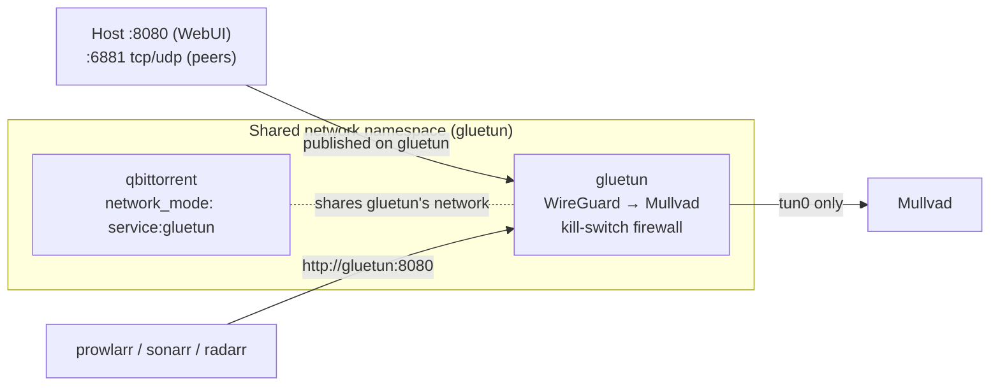

# Media & books stack (`media`)

> Compose project `~/docker/media` · network `server-net` · last verified 2026-09-25.
> **In one line:** Jellyfin for watching, Sonarr/Radarr/Prowlarr for finding, qBittorrent (forced through a VPN) for downloading, Kavita and LazyLibrarian for books. The library is currently empty.

## Containers

| Container | Image | Ports | Memory cap | Data lives in | Notes |
|---|---|---|---|---|---|
| gluetun | `qmcgaw/gluetun:latest` | 8080, 6881 tcp+udp (for qBittorrent) | none | — | Mullvad WireGuard VPN; `NET_ADMIN`, `/dev/net/tun`; healthy. Private key written literally in compose. |
| qbittorrent | `lscr.io/linuxserver/qbittorrent:latest` | via gluetun | none | `/home/<user>/docker/media/config/qbittorrent → /config`, `/mnt/tank/media/downloads` | `network_mode: service:gluetun`. Config path doesn't follow the `/docker/media/config/*` convention. |
| jellyfin | `jellyfin/jellyfin:latest` | 8096, 8920 | none | `/docker/media/config/jellyfin`, `/docker/media/cache/jellyfin`, `/mnt/tank/media` | Has the GPU (NVENC/NVDEC work on driver 535); healthy. |
| sonarr | `lscr.io/linuxserver/sonarr:latest` | 8989 | none | `/docker/media/config/sonarr`, `/mnt/tank/media` | TV |
| radarr | `lscr.io/linuxserver/radarr:latest` | 7878 | none | `/docker/media/config/radarr`, `/mnt/tank/media` | Movies |
| prowlarr | `lscr.io/linuxserver/prowlarr:latest` | 9696 | none | `/docker/media/config/prowlarr` | Indexer hub for the others |
| kavita | `jvmilazz0/kavita:latest` | 5000 | none | `/docker/media/config/kavita`, `/mnt/tank/media/books` | Book/comic reader; healthy |
| lazylibrarian | `lscr.io/linuxserver/lazylibrarian:latest` | 5299 | none | `/docker/media/config/lazylibrarian`, `/mnt/tank/media/{downloads,books}` | Calibre mod installed |

**Who can reach it:** LAN and tailnet only (by `http://<server>:<port>`). None of these have a domain name or tunnel.

## How the VPN kill switch works

1. qBittorrent has **no network of its own**; it lives inside Gluetun's network.
2. Gluetun only lets traffic out through the VPN tunnel. If the VPN drops, torrent traffic stops instead of leaking over your home connection.
3. That's why qBittorrent's ports are published **on the gluetun service**, and why other apps reach it as `gluetun:8080`.
4. After restarting Gluetun, run `docker compose up -d` in `~/docker/media` so qBittorrent reattaches.

Full networking detail: [architecture/networking-and-security.md §3](../architecture/networking-and-security.md#3-gluetun-vpn-network-mode-sharing).

## Backups

None, and they're not critical: app configs are small (`/docker/media/config`, ~35 MB) and the library is empty. Include `/docker/media` in the planned config backup ([roadmap](../roadmap/ROADMAP.md)).
